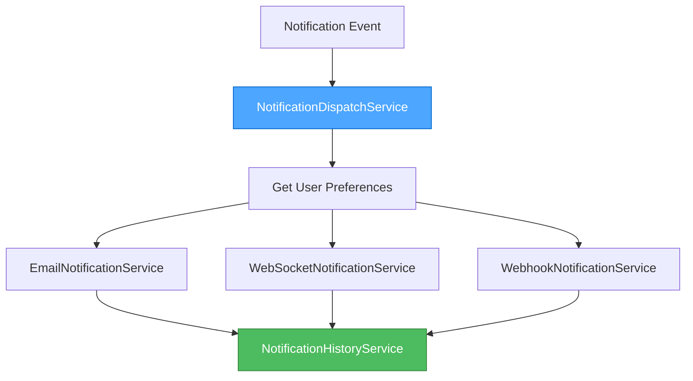
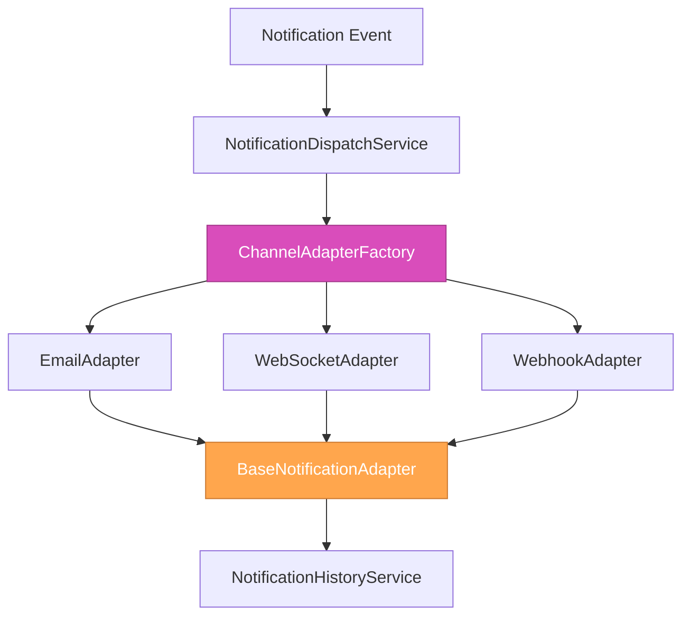
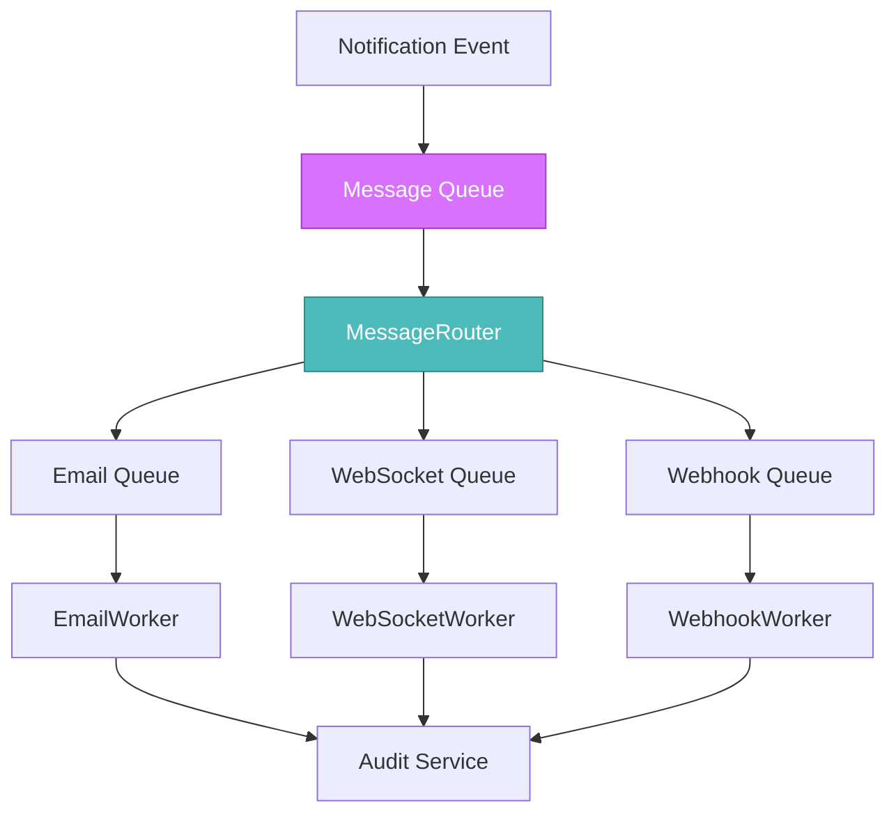

# CREATIVE PHASE: IntelliBrowse Notification Engine Architecture Design

🎨🎨🎨 ENTERING CREATIVE PHASE: ARCHITECTURE DESIGN 🎨🎨🎨
**Focus**: Notification Engine multi-channel architecture and orchestration patterns  
**Objective**: Design robust, extensible notification system with multiple delivery channels  
**Requirements**: Multi-channel delivery, user preferences, retry logic, observability  

## 📋 COMPONENT DESCRIPTION

### What is the Notification Engine?
A comprehensive multi-channel notification system that orchestrates the delivery of messages across email, WebSocket (in-app), and webhook channels based on user preferences, with robust retry logic, audit trails, and performance monitoring.

### Core Responsibilities
- **Event Processing**: Accept notification requests from internal services
- **Recipient Resolution**: Determine target users based on roles and preferences
- **Channel Routing**: Route messages through appropriate delivery channels
- **Delivery Orchestration**: Manage async delivery with retry and fallback logic
- **Audit & Monitoring**: Track delivery status and performance metrics

## 🔍 REQUIREMENTS & CONSTRAINTS

### Functional Requirements
- **Multi-channel Delivery**: Email, WebSocket, webhook with channel-specific configurations
- **User Preference Routing**: Respect user notification preferences and channel selection
- **Retry Logic**: Exponential backoff with configurable limits per channel
- **Template System**: Dynamic content generation with user context
- **Audit Trail**: Complete delivery history for compliance and debugging

### Performance Constraints
- **Dispatch Latency**: <1 second from trigger to channel processing
- **Email Delivery**: <30 seconds average delivery time
- **WebSocket Delivery**: <100ms real-time notification display
- **Concurrent Users**: Support 1000+ concurrent users, 10k+ daily notifications

### Integration Constraints
- **IntelliBrowse Patterns**: Consistent with existing service/controller/route layering
- **JWT Authentication**: Integration with existing user context and permissions
- **MongoDB Motor**: Async database operations with existing connection patterns
- **Alert Management**: Replace existing notification placeholders seamlessly

## 🏗️ DESIGN CHALLENGE 1: NOTIFICATION ORCHESTRATION FLOW

### Option 1: Direct Service-to-Channel Pattern


**Pros**:
- Simple, direct routing with minimal complexity
- Easy to understand and debug
- Fast execution path with fewer intermediate steps
- Aligns with existing IntelliBrowse service patterns

**Cons**:
- Tight coupling between dispatch and individual services
- Difficult to add new channels without modifying dispatch logic
- No centralized channel abstraction for consistency

### Option 2: Channel Adapter Factory Pattern


**Pros**:
- Excellent extensibility for new channels
- Consistent interface across all delivery mechanisms
- Centralized retry and error handling in base adapter
- Easy to test individual channels in isolation

**Cons**:
- Additional abstraction layer adds complexity
- Factory pattern may be overkill for current 3-channel requirement
- More difficult to optimize channel-specific behaviors

### Option 3: Event-Driven Pipeline with Message Queue


**Pros**:
- Excellent scalability and resilience
- Natural support for retry logic and dead letter queues
- Decouples message production from consumption
- Future-ready for distributed systems

**Cons**:
- Significant complexity increase for current requirements
- Requires additional infrastructure (Redis/RabbitMQ)
- May be over-engineered for IntelliBrowse's current scale
- Debugging becomes more complex across queue boundaries

### **Recommended Approach**: Option 2 - Channel Adapter Factory Pattern
**Rationale**: Provides the best balance of extensibility and maintainability while staying within IntelliBrowse's architectural patterns. The factory pattern allows for easy addition of new channels while maintaining consistent interfaces and centralized error handling.

## 🔌 DESIGN CHALLENGE 2: MODULAR CHANNEL ADAPTER INTERFACE

### Base Adapter Interface Design
```python
from abc import ABC, abstractmethod
from typing import Dict, Any, Optional
from pydantic import BaseModel

class NotificationResult(BaseModel):
    success: bool
    message_id: Optional[str] = None
    delivery_time: float
    error_details: Optional[str] = None
    retry_count: int = 0

class BaseNotificationAdapter(ABC):
    """Abstract base class for all notification channel adapters"""
    
    def __init__(self, config: Dict[str, Any]):
        self.config = config
        self.retry_config = config.get('retry', {})
        
    @abstractmethod
    async def send_notification(
        self, 
        recipient: str, 
        content: Dict[str, Any], 
        context: Dict[str, Any]
    ) -> NotificationResult:
        """Send notification through this channel"""
        pass
    
    @abstractmethod
    async def validate_config(self) -> bool:
        """Validate adapter configuration"""
        pass
    
    @abstractmethod
    async def health_check(self) -> bool:
        """Check adapter health and connectivity"""
        pass
    
    async def should_retry(self, error: Exception, attempt: int) -> bool:
        """Determine if delivery should be retried"""
        max_retries = self.retry_config.get('max_retries', 3)
        return attempt < max_retries and self._is_retryable_error(error)
    
    def _is_retryable_error(self, error: Exception) -> bool:
        """Override in subclasses for channel-specific retry logic"""
        return True
```

### Email Adapter Implementation
```python
class EmailAdapter(BaseNotificationAdapter):
    """Email notification delivery adapter"""
    
    async def send_notification(
        self, 
        recipient: str, 
        content: Dict[str, Any], 
        context: Dict[str, Any]
    ) -> NotificationResult:
        provider = self.config.get('provider', 'sendgrid')
        
        if provider == 'sendgrid':
            return await self._send_via_sendgrid(recipient, content, context)
        elif provider == 'ses':
            return await self._send_via_ses(recipient, content, context)
        else:
            raise ValueError(f"Unsupported email provider: {provider}")
    
    async def _send_via_sendgrid(self, recipient: str, content: Dict[str, Any], context: Dict[str, Any]) -> NotificationResult:
        # SendGrid implementation with error handling
        pass
    
    def _is_retryable_error(self, error: Exception) -> bool:
        # Email-specific retry logic (avoid retry on invalid email addresses)
        if isinstance(error, InvalidEmailError):
            return False
        return True
```

### WebSocket Adapter Implementation
```python
class WebSocketAdapter(BaseNotificationAdapter):
    """Real-time WebSocket notification adapter"""
    
    def __init__(self, config: Dict[str, Any]):
        super().__init__(config)
        self.connection_manager = WebSocketConnectionManager()
    
    async def send_notification(
        self, 
        recipient: str, 
        content: Dict[str, Any], 
        context: Dict[str, Any]
    ) -> NotificationResult:
        user_connections = await self.connection_manager.get_user_connections(recipient)
        
        if not user_connections:
            # Fallback to SSE or store for later delivery
            return await self._fallback_delivery(recipient, content, context)
        
        results = []
        for connection in user_connections:
            result = await self._send_to_connection(connection, content)
            results.append(result)
        
        return self._aggregate_results(results)
```

## 🎯 DESIGN CHALLENGE 3: USER PREFERENCE-DRIVEN ROUTING

### User Preference Model Design
```python
class NotificationChannelPreference(BaseModel):
    channel: str  # 'email', 'websocket', 'webhook'
    enabled: bool = True
    priority: int = 1  # 1=highest, 5=lowest
    config: Dict[str, Any] = {}  # channel-specific configuration

class UserNotificationPreferences(BaseModel):
    user_id: str
    channels: List[NotificationChannelPreference]
    global_settings: Dict[str, Any] = {}
    notification_types: Dict[str, List[str]] = {}  # type -> enabled channels
    quiet_hours: Optional[Dict[str, Any]] = None
    
    def get_preferred_channels(self, notification_type: str) -> List[str]:
        """Get ordered list of preferred channels for notification type"""
        if notification_type in self.notification_types:
            enabled_channels = self.notification_types[notification_type]
        else:
            enabled_channels = [ch.channel for ch in self.channels if ch.enabled]
        
        # Sort by priority
        channel_priorities = {ch.channel: ch.priority for ch in self.channels}
        return sorted(enabled_channels, key=lambda ch: channel_priorities.get(ch, 5))
```

### Routing Logic Options

#### Option A: Sequential Delivery with Fallback
```python
async def deliver_with_fallback(
    self, 
    notification: NotificationModel, 
    preferences: UserNotificationPreferences
) -> List[NotificationResult]:
    """Deliver through preferred channel, fallback on failure"""
    preferred_channels = preferences.get_preferred_channels(notification.type)
    results = []
    
    for channel in preferred_channels:
        adapter = self.adapter_factory.get_adapter(channel)
        result = await adapter.send_notification(
            notification.recipient, 
            notification.content, 
            notification.context
        )
        results.append(result)
        
        if result.success:
            break  # Stop on first successful delivery
    
    return results
```

#### Option B: Parallel Delivery to All Preferred Channels
```python
async def deliver_parallel(
    self, 
    notification: NotificationModel, 
    preferences: UserNotificationPreferences
) -> List[NotificationResult]:
    """Deliver through all enabled channels simultaneously"""
    enabled_channels = preferences.get_preferred_channels(notification.type)
    
    tasks = []
    for channel in enabled_channels:
        adapter = self.adapter_factory.get_adapter(channel)
        task = adapter.send_notification(
            notification.recipient, 
            notification.content, 
            notification.context
        )
        tasks.append(task)
    
    return await asyncio.gather(*tasks, return_exceptions=True)
```

**Recommended**: Option A for most use cases, Option B for critical notifications

## 📊 DESIGN CHALLENGE 4: OBSERVABILITY & FAILURE RECOVERY

### Audit Trail Model Design
```python
class NotificationDeliveryHistory(BaseModel):
    id: ObjectId = Field(default_factory=ObjectId)
    notification_id: str
    user_id: str
    channel: str
    status: str  # 'pending', 'sent', 'delivered', 'failed', 'retrying'
    attempt_number: int
    sent_at: datetime
    delivered_at: Optional[datetime] = None
    error_details: Optional[str] = None
    delivery_time_ms: Optional[float] = None
    channel_metadata: Dict[str, Any] = {}  # provider-specific data
    retry_scheduled_at: Optional[datetime] = None
    created_at: datetime = Field(default_factory=datetime.utcnow)
    
    class Config:
        collection = "notification_history"
```

### Retry Strategy Design
```python
class RetryStrategy:
    def __init__(self, config: Dict[str, Any]):
        self.max_retries = config.get('max_retries', 3)
        self.base_delay = config.get('base_delay_seconds', 1)
        self.max_delay = config.get('max_delay_seconds', 300)
        self.exponential_base = config.get('exponential_base', 2)
    
    def calculate_delay(self, attempt: int) -> float:
        """Calculate delay for next retry attempt"""
        delay = self.base_delay * (self.exponential_base ** attempt)
        return min(delay, self.max_delay)
    
    def should_retry(self, attempt: int, error: Exception) -> bool:
        """Determine if retry should be attempted"""
        if attempt >= self.max_retries:
            return False
        
        # Add jitter to prevent thundering herd
        return random.random() < 0.8  # 80% chance to retry
```

## ⚡ DESIGN CHALLENGE 5: ASYNC ARCHITECTURE PATTERN

### Option 1: FastAPI BackgroundTasks Pattern
```python
from fastapi import BackgroundTasks

class NotificationDispatchService:
    async def dispatch_notification(
        self, 
        notification: NotificationRequest,
        background_tasks: BackgroundTasks
    ) -> NotificationResponse:
        # Immediate response to caller
        notification_id = await self._create_notification_record(notification)
        
        # Async processing in background
        background_tasks.add_task(
            self._process_notification_async, 
            notification_id, 
            notification
        )
        
        return NotificationResponse(
            notification_id=notification_id,
            status="queued",
            message="Notification queued for processing"
        )
```

**Pros**: Simple, leverages FastAPI built-in capability, good for low-medium volume
**Cons**: Not persistent, limited error handling, scaling challenges

### Option 2: AsyncIO Task Queue with Persistence
```python
import asyncio
from typing import Queue

class NotificationTaskQueue:
    def __init__(self):
        self.queue: asyncio.Queue = asyncio.Queue()
        self.workers: List[asyncio.Task] = []
        self.running = False
    
    async def enqueue(self, notification: NotificationModel) -> None:
        await self.queue.put(notification)
        await self._persist_to_db(notification)
    
    async def start_workers(self, worker_count: int = 3) -> None:
        self.running = True
        for i in range(worker_count):
            worker = asyncio.create_task(self._worker(f"worker-{i}"))
            self.workers.append(worker)
    
    async def _worker(self, worker_id: str) -> None:
        while self.running:
            try:
                notification = await asyncio.wait_for(
                    self.queue.get(), timeout=1.0
                )
                await self._process_notification(notification)
            except asyncio.TimeoutError:
                continue
```

**Pros**: Better persistence, worker scaling, error isolation
**Cons**: More complex, requires careful resource management

**Recommended**: Option 1 for initial implementation, Option 2 for future scaling

## 🎨 CREATIVE CHECKPOINT: Architecture Integration

**Progress**: All 5 design challenges explored with multiple options
**Decisions**: 
- Channel Adapter Factory for orchestration
- Base adapter interface with concrete implementations
- Sequential delivery with fallback for routing
- Comprehensive audit trail with retry strategies
- FastAPI BackgroundTasks for async processing

**Next Steps**: Validate against IntelliBrowse patterns and prepare implementation guidelines

## 🔍 IMPLEMENTATION GUIDELINES

### Service Integration Points
```python
# Dependency injection pattern following IntelliBrowse standards
class NotificationDispatchService:
    def __init__(
        self,
        adapter_factory: ChannelAdapterFactory = Depends(get_adapter_factory),
        preference_service: NotificationPreferenceService = Depends(),
        history_service: NotificationHistoryService = Depends(),
        template_service: NotificationTemplateService = Depends()
    ):
        self.adapter_factory = adapter_factory
        self.preference_service = preference_service
        self.history_service = history_service
        self.template_service = template_service
```

### Controller Integration
```python
@router.post("/notifications", response_model=NotificationResponse)
async def send_notification(
    request: NotificationRequest,
    background_tasks: BackgroundTasks,
    current_user: User = Depends(get_current_user),
    dispatch_service: NotificationDispatchService = Depends()
) -> NotificationResponse:
    return await dispatch_service.dispatch_notification(
        request, background_tasks, current_user
    )
```

### Alert Management Integration
```python
# Replace existing placeholders in Alert Management Service
class AlertManagementService:
    def __init__(
        self, 
        notification_service: NotificationDispatchService = Depends()
    ):
        self.notification_service = notification_service
    
    async def _send_email_notification(self, alert_event, channel_config) -> None:
        """Replacement for existing placeholder"""
        notification = NotificationRequest(
            type="system_alert",
            recipients=[channel_config.get('email')],
            content=self._format_alert_content(alert_event),
            channels=["email"]
        )
        await self.notification_service.dispatch_notification(notification)
```

🎨🎨🎨 EXITING CREATIVE PHASE 🎨🎨🎨

**Summary**: Comprehensive architecture design for multi-channel notification system
**Key Decisions**: 
- Channel Adapter Factory pattern for extensibility
- Sequential delivery with intelligent fallback
- Comprehensive audit trail with exponential backoff retry
- FastAPI BackgroundTasks for async processing
- Full integration with existing IntelliBrowse patterns

**Next Steps**: Technology validation followed by systematic implementation across 3 phases

**Implementation Readiness**: ✅ Architecture fully designed and ready for implementation 