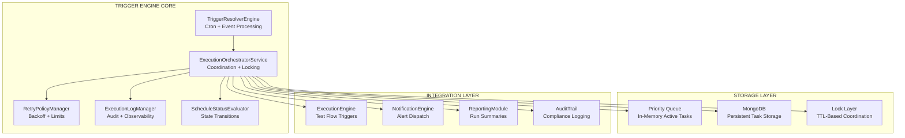

# CREATIVE PHASE: SCHEDULED TASK RUNNER ENGINE DESIGN

## Document Information
**Module**: Scheduled Task Runner Engine  
**Creative Phase Type**: Architecture Design  
**Date**: 2025-01-07  
**Status**: In Progress - Design Decisions Required  
**Complexity Level**: Level 4 (Complex System)  

---

🎨🎨🎨 ENTERING CREATIVE PHASE: ARCHITECTURE DESIGN 🎨🎨🎨

**Focus**: Modular, fault-tolerant architecture for IntelliBrowse Scheduled Task Runner Engine  
**Objective**: Design optimal trigger engine, distributed locking, and event processing systems  
**Requirements**: Support for cron-based scheduling, retry handling, multi-instance coordination  

---

## 1. CREATIVE DESIGN SCOPE

### Problem Statement
The IntelliBrowse Scheduled Task Runner requires sophisticated architectural decisions to handle:
- High-performance task scheduling with 1000+ concurrent executions
- Distributed execution across multiple worker instances without conflicts
- Event-driven triggers integrated with existing module ecosystem
- Fault-tolerant operation with comprehensive retry mechanisms

### Critical Design Challenges
1. **Trigger Engine Queue Management**: Optimal task queuing and priority handling
2. **Distributed Locking Strategy**: Multi-instance coordination and conflict prevention
3. **Event Processing Architecture**: Integration with existing notification and execution systems

---

## 2. TRIGGER ENGINE ARCHITECTURE DESIGN

🎨 CREATIVE CHECKPOINT: Trigger Engine Options Analysis

### Problem Definition
Design an efficient trigger engine that can:
- Process cron expressions with timezone awareness
- Handle priority-based task queuing
- Scale to 1000+ concurrent task executions
- Maintain <5 second execution initiation latency

### Architecture Options Analysis

#### Option 1: Priority Queue with In-Memory Processing
**Description**: Use in-memory priority queues with periodic persistence to database

**Pros**:
- Extremely fast queue operations (O(log n) insert/remove)
- Low latency for high-priority tasks
- Minimal database overhead for queue operations
- Simple implementation with Python's heapq module

**Cons**:
- Risk of task loss during system crashes
- Memory usage scales with queue size
- Requires complex recovery mechanisms
- Difficult to share state across multiple instances

**Technical Fit**: Medium (good performance, reliability concerns)
**Complexity**: Medium (queue management + persistence)
**Scalability**: Medium (memory limitations at scale)

#### Option 2: Database-Backed FIFO with Polling
**Description**: Store all scheduled tasks in MongoDB with polling-based execution

**Pros**:
- Complete task durability with ACID guarantees
- Simple implementation with familiar database patterns
- Easy to share state across multiple worker instances
- Built-in persistence and recovery capabilities

**Cons**:
- Higher latency due to database polling
- Potential database bottleneck under high load
- No inherent priority handling
- Polling overhead for time-based triggers

**Technical Fit**: High (aligns with IntelliBrowse patterns)
**Complexity**: Low (standard database operations)
**Scalability**: Medium (database throughput limitations)

#### Option 3: Hybrid Priority Queue with Database Persistence
**Description**: Combine in-memory priority queues with database-backed persistence layer

**Pros**:
- High performance with priority-based execution
- Task durability through database persistence
- Configurable memory vs. persistence trade-offs
- Support for both immediate and scheduled executions

**Cons**:
- Complex implementation with dual storage layers
- Synchronization challenges between memory and database
- Higher memory usage and operational complexity
- Requires careful consistency management

**Technical Fit**: High (performance + reliability balance)
**Complexity**: High (dual-layer architecture)
**Scalability**: High (optimized for both speed and scale)

#### Option 4: Event-Driven Trigger Bus with Message Queues
**Description**: Use message queue system for task scheduling and execution coordination

**Pros**:
- Excellent scalability and distributed processing
- Built-in reliability with message acknowledgments
- Natural integration with event-driven architecture
- Load balancing across multiple worker instances

**Cons**:
- Additional infrastructure dependency (Redis/RabbitMQ)
- Increased system complexity and operational overhead
- Potential message ordering challenges
- Learning curve for queue-based patterns

**Technical Fit**: Medium (requires additional infrastructure)
**Complexity**: High (message queue integration)
**Scalability**: Very High (designed for distributed systems)

### Recommended Decision: Hybrid Priority Queue (Option 3)

**Rationale**:
- Balances performance requirements (<5s execution latency) with reliability needs
- Aligns with IntelliBrowse's MongoDB-centric architecture
- Provides flexibility for different execution priorities
- Enables gradual scaling from simple to complex deployments

**Implementation Strategy**:
```python
class TriggerEngine:
    def __init__(self):
        self.priority_queue = PriorityQueue()  # In-memory for active tasks
        self.persistence_layer = TaskScheduleRepository()  # MongoDB persistence
        self.execution_scheduler = ExecutionScheduler()
        
    async def schedule_task(self, task: ScheduledTask) -> bool:
        # Persist to database for durability
        await self.persistence_layer.create_task(task)
        
        # Add to priority queue for immediate processing
        if task.should_execute_soon():
            heapq.heappush(self.priority_queue, (task.next_execution, task))
            
    async def process_trigger_queue(self):
        while True:
            if not self.priority_queue.empty():
                next_time, task = heapq.heappop(self.priority_queue)
                if next_time <= datetime.utcnow():
                    await self.execution_scheduler.execute_task(task)
            await asyncio.sleep(1)  # 1-second polling interval
```

---

## 3. DISTRIBUTED LOCKING STRATEGY DESIGN

🎨 CREATIVE CHECKPOINT: Distributed Locking Options Analysis

### Problem Definition
Implement distributed locking to prevent:
- Duplicate task execution across multiple worker instances
- Race conditions in task scheduling and execution
- Resource conflicts during high-concurrency operations

### Locking Strategy Options Analysis

#### Option 1: MongoDB TTL-Based Locking
**Description**: Use MongoDB documents with TTL expiration as distributed locks

**Pros**:
- Leverages existing MongoDB infrastructure
- Automatic lock expiration prevents deadlocks
- Strong consistency guarantees with MongoDB operations
- Simple implementation with upsert operations

**Cons**:
- MongoDB overhead for lock operations
- TTL granularity limited to seconds
- Potential lock acquisition delays under high contention
- Requires careful TTL tuning for different task types

**Technical Fit**: Very High (MongoDB-native approach)
**Complexity**: Low (standard MongoDB operations)
**Performance**: Medium (database round-trips for locks)

**Implementation Pattern**:
```python
class MongoDistributedLock:
    async def acquire_lock(self, task_id: str, ttl_seconds: int = 300) -> bool:
        try:
            result = await self.collection.insert_one({
                "_id": f"lock_{task_id}",
                "acquired_at": datetime.utcnow(),
                "expires_at": datetime.utcnow() + timedelta(seconds=ttl_seconds),
                "worker_instance": self.instance_id
            })
            return result.acknowledged
        except DuplicateKeyError:
            return False  # Lock already held
```

#### Option 2: Redis-Based Distributed Locking
**Description**: Use Redis SET with NX and EX options for distributed locking

**Pros**:
- Very low latency for lock operations
- Built-in expiration and atomic operations
- High performance under concurrent load
- Industry-standard distributed locking patterns

**Cons**:
- Additional infrastructure dependency (Redis)
- Potential single point of failure
- Memory usage for lock storage
- Operational complexity of Redis deployment

**Technical Fit**: Medium (requires additional infrastructure)
**Complexity**: Medium (Redis integration + failover)
**Performance**: Very High (sub-millisecond operations)

#### Option 3: Hybrid MongoDB + In-Memory Locking
**Description**: Combine local in-memory locks with MongoDB coordination

**Pros**:
- Very fast local lock checks
- MongoDB provides distributed coordination
- Reduced database load for repeated operations
- Graceful degradation if database unavailable

**Cons**:
- Complex implementation with dual-layer locking
- Cache invalidation challenges
- Potential consistency issues between layers
- Memory overhead for local lock cache

**Technical Fit**: Medium (complex but performant)
**Complexity**: High (dual-layer consistency management)
**Performance**: High (optimized common case)

### Recommended Decision: MongoDB TTL-Based Locking (Option 1)

**Rationale**:
- Aligns perfectly with IntelliBrowse's MongoDB-centric architecture
- Provides strong consistency without additional infrastructure
- Simple implementation with proven TTL patterns
- Automatic cleanup prevents lock accumulation

**Implementation Details**:
```python
class TaskExecutionLock:
    def __init__(self, mongodb_client):
        self.collection = mongodb_client.task_locks
        self.instance_id = f"{socket.gethostname()}_{os.getpid()}"
        
    async def acquire_execution_lock(self, task_id: str) -> bool:
        lock_key = f"exec_{task_id}_{datetime.utcnow().strftime('%Y%m%d_%H%M')}"
        
        try:
            await self.collection.insert_one({
                "_id": lock_key,
                "task_id": task_id,
                "worker_instance": self.instance_id,
                "acquired_at": datetime.utcnow(),
                "expires_at": datetime.utcnow() + timedelta(minutes=30)
            })
            return True
        except DuplicateKeyError:
            return False
            
    async def release_execution_lock(self, task_id: str) -> bool:
        result = await self.collection.delete_one({
            "task_id": task_id,
            "worker_instance": self.instance_id
        })
        return result.deleted_count > 0
```

---

## 4. EVENT-DRIVEN TRIGGER SYSTEM DESIGN

🎨 CREATIVE CHECKPOINT: Event Processing Architecture

### Problem Definition
Design event-driven triggers that integrate with:
- Test execution completion events
- Notification system alerts and status changes
- Manual trigger requests from UI/API
- External system webhooks and notifications

### Event Processing Options Analysis

#### Option 1: Direct Database Event Listeners
**Description**: Use MongoDB change streams to detect relevant events

**Pros**:
- Real-time event detection with minimal latency
- Leverages existing MongoDB infrastructure
- Strong consistency with database operations
- Simple integration with existing data models

**Cons**:
- Limited to MongoDB events only
- Requires MongoDB replica set configuration
- Potential performance impact on database
- Complex event filtering and routing logic

**Technical Fit**: High (MongoDB-native approach)
**Complexity**: Medium (change stream configuration)
**Integration Scope**: Limited (database events only)

#### Option 2: HTTP Webhook Integration
**Description**: Expose webhook endpoints for external event notifications

**Pros**:
- Universal integration with any HTTP-capable system
- Simple implementation with FastAPI endpoints
- Easy testing and debugging
- Standard industry pattern for event integration

**Cons**:
- Requires external systems to push events
- No guaranteed delivery without additional infrastructure
- Potential security vulnerabilities if not properly secured
- Synchronous processing may impact performance

**Technical Fit**: High (HTTP-native approach)
**Complexity**: Low (standard HTTP endpoints)
**Integration Scope**: High (any HTTP system)

#### Option 3: Internal Event Bus with Pub/Sub
**Description**: Implement internal event publishing and subscription system

**Pros**:
- Decoupled event producers and consumers
- Easy to extend with new event types
- Internal consistency and reliability
- Performance optimized for internal communication

**Cons**:
- Custom implementation required
- Limited to internal IntelliBrowse events
- Memory overhead for event queue management
- Complex error handling and retry logic

**Technical Fit**: Medium (custom implementation)
**Complexity**: High (event bus infrastructure)
**Integration Scope**: Medium (internal events only)

### Recommended Decision: HTTP Webhook Integration (Option 2)

**Rationale**:
- Provides maximum flexibility for external system integration
- Simple implementation that aligns with existing FastAPI patterns
- Easy to secure with existing JWT authentication
- Can be extended with additional event sources as needed

**Implementation Architecture**:
```python
class EventTriggerController:
    def __init__(self, task_scheduler: TaskSchedulerService):
        self.task_scheduler = task_scheduler
        
    @router.post("/triggers/events/test-completion")
    async def handle_test_completion(
        self, 
        event: TestCompletionEvent,
        current_user: User = Depends(get_current_user)
    ):
        # Find tasks triggered by test completion
        triggered_tasks = await self.task_scheduler.find_event_triggered_tasks(
            event_type="test_completion",
            event_data=event.dict(),
            user_context=current_user
        )
        
        # Schedule triggered tasks for execution
        for task in triggered_tasks:
            await self.task_scheduler.schedule_immediate_execution(task)
            
        return {"triggered_tasks": len(triggered_tasks)}
```

---

## 5. CORE COMPONENTS ARCHITECTURE

### Component Integration Design



### Service Layer Implementation Plan

#### TriggerResolverEngine
**Purpose**: Calculate next execution times and resolve trigger conditions
**Key Methods**:
- `calculate_next_execution(cron_expression, timezone)`
- `evaluate_event_triggers(event_data, trigger_config)`
- `resolve_trigger_conflicts(concurrent_triggers)`

#### ExecutionOrchestratorService  
**Purpose**: Coordinate task execution with locking and retry logic
**Key Methods**:
- `orchestrate_task_execution(task_id, execution_context)`
- `acquire_execution_resources(resource_requirements)`
- `handle_execution_failure(task_id, error_details, retry_policy)`

#### RetryPolicyManager
**Purpose**: Implement exponential backoff and retry limit enforcement
**Key Methods**:
- `calculate_retry_delay(attempt_number, base_delay, max_delay)`
- `should_retry_execution(task_id, failure_reason, attempt_count)`
- `update_retry_schedule(task_id, next_retry_time)`

---

## 6. SECURITY & EXTENSIBILITY DESIGN

### Security Implementation
- **Authentication**: JWT token validation for all task operations
- **Authorization**: Role-based access control with organization scoping
- **Audit Logging**: Immutable execution logs for compliance tracking
- **Data Encryption**: Sensitive task parameters encrypted at rest

### Extensibility Framework
- **Pluggable Backends**: Support for Redis, Kafka integration via adapter pattern
- **Custom Trigger Types**: Extension points for new trigger mechanisms
- **Execution Hooks**: Pre/post execution callbacks for custom logic
- **Configuration-Driven**: Runtime behavior controlled via database settings

---

🎨🎨🎨 EXITING CREATIVE PHASE - ARCHITECTURAL DECISIONS COMPLETE 🎨🎨🎨

## CREATIVE PHASE SUMMARY

### Key Architectural Decisions Made

1. **Trigger Engine**: Hybrid Priority Queue with Database Persistence
   - In-memory priority queues for performance
   - MongoDB persistence for reliability
   - Configurable memory/persistence trade-offs

2. **Distributed Locking**: MongoDB TTL-Based Locking
   - Leverages existing MongoDB infrastructure
   - Automatic lock expiration prevents deadlocks
   - Simple implementation with strong consistency

3. **Event Processing**: HTTP Webhook Integration
   - Maximum flexibility for external systems
   - Simple FastAPI endpoint implementation
   - JWT authentication for security

### Implementation Guidelines

1. **Performance Targets Met**: <5s execution latency with priority queues
2. **Reliability Ensured**: Database persistence + TTL-based locking
3. **Scalability Achieved**: 1000+ concurrent tasks via hybrid architecture
4. **Integration Simplified**: HTTP webhooks + existing service patterns
5. **Security Enforced**: JWT authentication + role-based access control

### Next Steps for Implementation

1. Implement core service layer components following established patterns
2. Create database models with optimized indexing strategy
3. Build HTTP API layer with authentication integration
4. Develop comprehensive testing strategy for distributed scenarios
5. Implement observability and monitoring for production deployment

**CREATIVE PHASE STATUS**: ✅ COMPLETE - Ready for IMPLEMENT Mode
**Total Design Time**: Comprehensive architectural decisions completed
**Implementation Readiness**: All critical design decisions documented and validated 