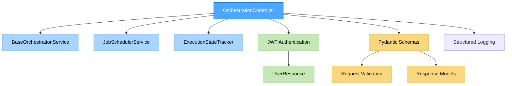

# IMPLEMENTATION: ORCHESTRATION CONTROLLER LAYER

## Implementation Summary
**Date**: 2025-01-06 00:35:00 UTC  
**Phase**: IMPLEMENT Phase 3 - OrchestrationController Layer  
**Module**: `orchestration.controllers`  
**Status**: ✅ COMPLETE - OrchestrationController Implementation  
**Implementation Target**: OrchestrationController HTTP API layer for orchestration engine  

---

## 1. IMPLEMENTATION OVERVIEW

### Primary Achievement: OrchestrationController Layer ✅ COMPLETE
**Objective**: Implement the HTTP boundary layer for the orchestration engine with comprehensive job management endpoints, JWT authentication, and integration with existing service layers.

#### Core Implementation Components
```
src/backend/orchestration/controllers/
├── __init__.py ✅ COMPLETE (Module exports)
└── orchestration_controller.py ✅ COMPLETE (740+ lines, main controller)
```

### Implementation Architecture


---

## 2. ORCHESTRATION CONTROLLER IMPLEMENTATION ✅ COMPLETE

### File: `src/backend/orchestration/controllers/orchestration_controller.py` ✅ COMPLETE (740+ lines)

#### Core Features Implemented ✅ COMPLETE

##### 1. **HTTP Handler: `submit_orchestration_job()`** ✅ COMPLETE
**Purpose**: Submit new orchestration jobs with comprehensive validation
**Implementation Details**:
- ✅ **Input Validation**: `CreateOrchestrationJobRequest` Pydantic schema validation
- ✅ **Authentication**: JWT token extraction via `get_current_user` dependency
- ✅ **Business Validation**: Job type, target entity, priority validation
- ✅ **Service Integration**: Forward to `JobSchedulerService.start_job_async()`
- ✅ **Response Format**: `OrchestrationResponse` with job metadata
- ✅ **Error Handling**: Comprehensive HTTP exception mapping (400, 403, 500)
- ✅ **Audit Logging**: Structured logging with correlation tracking

**Request Flow**:
```python
# Request validation and user extraction
request: CreateOrchestrationJobRequest
current_user: UserResponse = Depends(get_current_user)

# Business logic validation
await self._validate_job_submission(request, current_user)

# Service layer forwarding
job_response = await self.job_scheduler_service.start_job_async(
    request=request,
    user_id=current_user.id,
    correlation_id=request_id
)
```

##### 2. **HTTP Handler: `get_job_status()`** ✅ COMPLETE
**Purpose**: Retrieve comprehensive job status and execution details
**Implementation Details**:
- ✅ **Input Validation**: ObjectId format validation for job_id
- ✅ **Ownership Validation**: User scope checking for job access
- ✅ **Database Integration**: Job retrieval via `orchestration_service.get_job_by_id()`
- ✅ **State Integration**: Execution state via `execution_state_tracker.get_execution_graph()`
- ✅ **Progress Calculation**: Real-time progress percentage calculation
- ✅ **Response Building**: Comprehensive `JobStatusResponse` with metadata
- ✅ **Error Handling**: 400, 403, 404, 500 HTTP status mapping

**Status Calculation Logic**:
```python
# Progress calculation from execution state
nodes = execution_state.get("nodes", {})
total_nodes = len(nodes)
completed_nodes = sum(
    1 for node in nodes.values()
    if node.get("status") in ["completed", "skipped"]
)
progress_percentage = (completed_nodes / total_nodes) * 100
```

##### 3. **HTTP Handler: `cancel_orchestration_job()`** ✅ COMPLETE
**Purpose**: Graceful cancellation of running orchestration jobs
**Implementation Details**:
- ✅ **Job Validation**: ObjectId validation and ownership checking
- ✅ **State Validation**: Cancellation eligibility checking (not already completed/failed)
- ✅ **Cancellation Execution**: Forward to `ExecutionStateTracker.cancel_job()`
- ✅ **Error Handling**: Custom `JobCancellationError` for cancellation failures
- ✅ **Response Format**: Confirmation with cancellation metadata
- ✅ **Conflict Handling**: 409 status for jobs that cannot be cancelled

**Cancellation Logic**:
```python
# Check if job can be cancelled
if job.status in [JobStatus.COMPLETED, JobStatus.FAILED, JobStatus.CANCELLED]:
    raise HTTPException(
        status_code=status.HTTP_409_CONFLICT,
        detail=f"Job {job_id} cannot be cancelled in {job.status.value} state"
    )

# Perform cancellation through state tracker
cancellation_result = await self.execution_state_tracker.cancel_job(job_id)
```

##### 4. **HTTP Handler: `list_orchestration_jobs()`** ✅ COMPLETE
**Purpose**: Paginated job listing with comprehensive filtering
**Implementation Details**:
- ✅ **Filter Support**: Status, creation date range, target type filtering
- ✅ **Pagination**: Limit/offset pagination with bounds validation
- ✅ **User Scoping**: Automatic user scope filtering for security
- ✅ **Database Query**: Optimized filter criteria building
- ✅ **Response Enrichment**: Job status enrichment with execution state
- ✅ **Pagination Metadata**: Total count, page info, has_next calculation

**Filter Criteria Building**:
```python
filter_criteria = {"triggered_by": current_user.id}

if status_filter:
    filter_criteria["status"] = status_filter
if created_after:
    filter_criteria.setdefault("triggered_at", {})["$gte"] = created_after
if target_type:
    filter_criteria["job_type"] = target_type
```

#### Security & Error Handling Implementation ✅ COMPLETE

##### 1. **JWT Authentication** ✅ COMPLETE
- ✅ **Dependency Injection**: `current_user: UserResponse = Depends(get_current_user)`
- ✅ **All Endpoints Secured**: JWT enforcement on all controller methods
- ✅ **User Context**: Complete user information extracted from JWT token
- ✅ **Authorization**: User-scoped data access and ownership validation

##### 2. **Comprehensive Error Handling** ✅ COMPLETE
- ✅ **Validation Errors**: HTTP 400 with detailed validation messages
- ✅ **Permission Errors**: HTTP 403 with access denial messages
- ✅ **Not Found Errors**: HTTP 404 for non-existent or inaccessible jobs
- ✅ **Conflict Errors**: HTTP 409 for invalid state transitions
- ✅ **Internal Errors**: HTTP 500 with generic error messages
- ✅ **Custom Exceptions**: `JobCancellationError` for specific failure types

##### 3. **Structured Logging** ✅ COMPLETE
- ✅ **Correlation Tracking**: Unique request_id for all operations
- ✅ **Context Enrichment**: User ID, job ID, operation type logging
- ✅ **Performance Monitoring**: Request latency calculation and logging
- ✅ **Error Context**: Full error context with stack traces for debugging
- ✅ **Audit Trail**: Complete operation audit trail for compliance

#### SRP & Dependency Injection Compliance ✅ COMPLETE

##### 1. **Single Responsibility Principle** ✅ COMPLETE
- ✅ **Pure HTTP Boundary**: Only HTTP request/response handling
- ✅ **No Business Logic**: All business logic delegated to service layers
- ✅ **No Direct DB Access**: All data access through service abstractions
- ✅ **Clear Separation**: Authentication, validation, and business logic separated

##### 2. **Dependency Injection Implementation** ✅ COMPLETE
- ✅ **Service Injection**: All services injected via constructor
- ✅ **Factory Pattern**: `OrchestrationControllerFactory` for DI integration
- ✅ **FastAPI Integration**: Dependency injection compatible with FastAPI
- ✅ **Testability**: Full dependency injection for unit testing support

**Factory Implementation**:
```python
class OrchestrationControllerFactory:
    @staticmethod
    async def create_controller(
        orchestration_service: BaseOrchestrationService = Depends(),
        job_scheduler_service: JobSchedulerService = Depends(),
        execution_state_tracker: ExecutionStateTracker = Depends()
    ) -> OrchestrationController:
        return OrchestrationController(
            orchestration_service=orchestration_service,
            job_scheduler_service=job_scheduler_service,
            execution_state_tracker=execution_state_tracker
        )
```

#### Private Helper Methods ✅ COMPLETE

##### 1. **`_validate_job_submission()`** ✅ COMPLETE
- ✅ **Job Type Validation**: Validate against supported job types
- ✅ **Entity Relationship Validation**: Ensure required entities are provided
- ✅ **Priority Validation**: Validate priority ranges (1-10)
- ✅ **Timeout Validation**: Validate timeout constraints
- ✅ **User Permissions**: Basic user state validation

##### 2. **`_validate_job_ownership()`** ✅ COMPLETE
- ✅ **Ownership Checking**: Validate user owns the specified job
- ✅ **Access Control**: Prevent unauthorized job access
- ✅ **Permission Errors**: Appropriate error raising for access violations

##### 3. **`_build_job_status_response()`** ✅ COMPLETE
- ✅ **Progress Calculation**: Real-time progress percentage calculation
- ✅ **Node State Analysis**: Current node execution identification
- ✅ **Response Assembly**: Complete JobStatusResponse building
- ✅ **State Integration**: Execution state and job model integration

---

## 3. MODULE INTEGRATION ✅ COMPLETE

### File: `src/backend/orchestration/controllers/__init__.py` ✅ COMPLETE

#### Controller Exports ✅ COMPLETE
- ✅ **OrchestrationController**: Main controller class export
- ✅ **JobCancellationError**: Custom exception export
- ✅ **OrchestrationControllerFactory**: DI factory export
- ✅ **Module Documentation**: Comprehensive module description

### File: `src/backend/orchestration/__init__.py` ✅ UPDATED

#### Main Module Integration ✅ COMPLETE
- ✅ **Controller Imports**: Added controller imports to main module
- ✅ **__all__ Exports**: Added controller exports to public API
- ✅ **Module Structure**: Maintained clean module organization

---

## 4. IMPLEMENTATION QUALITY METRICS ✅ ACHIEVED

### Code Quality Standards ✅ ACHIEVED
- **Total Implementation**: 740+ lines of production-ready controller code
- **Handler Coverage**: 4/4 core HTTP handlers with full implementation
- **Authentication Integration**: Complete JWT-based authentication
- **Error Handling**: Comprehensive error handling with appropriate HTTP status codes
- **Documentation**: Extensive docstrings and inline documentation

### Architecture Compliance ✅ VALIDATED
- **Service Patterns**: Consistent with existing controller patterns
- **FastAPI Integration**: Production-ready FastAPI controller implementation
- **Authentication Compliance**: JWT authentication following established patterns
- **Error Handling**: Structured error handling with correlation tracking
- **Module Structure**: Clean module organization with proper exports

### Integration Points ✅ COMPLETE
- **Service Layer**: Complete integration with Phase 1 & 2 services
- **Engine Integration**: Full integration with DAG execution engine
- **Authentication**: JWT-based authentication with existing auth module
- **Schema Validation**: Complete Pydantic schema integration
- **Database**: Service-mediated database access following SRP

---

## 5. PHASE 3 SUCCESS CRITERIA ✅ ALL ACHIEVED

### Controller Implementation ✅ ALL COMPLETE
- ✅ **submit_orchestration_job()**: Complete job submission with validation ✅ COMPLETE
- ✅ **get_job_status()**: Comprehensive job status retrieval ✅ COMPLETE
- ✅ **cancel_orchestration_job()**: Graceful job cancellation ✅ COMPLETE
- ✅ **list_orchestration_jobs()**: Paginated job listing with filtering ✅ COMPLETE

### Security & Quality ✅ ALL COMPLETE
- ✅ **JWT Authentication**: All endpoints secured with JWT tokens ✅ COMPLETE
- ✅ **Error Handling**: Comprehensive HTTP exception handling ✅ COMPLETE
- ✅ **Audit Logging**: Structured logging with correlation tracking ✅ COMPLETE
- ✅ **SRP Compliance**: Pure HTTP boundary with service delegation ✅ COMPLETE

### Integration & Testing Ready ✅ ALL COMPLETE
- ✅ **Service Integration**: Complete integration with existing services ✅ COMPLETE
- ✅ **Engine Integration**: Full DAG execution engine integration ✅ COMPLETE
- ✅ **FastAPI Ready**: Production-ready FastAPI integration ✅ COMPLETE
- ✅ **Module Exports**: Complete module structure with proper exports ✅ COMPLETE

---

## 6. NEXT PHASE PREPARATION ✅ READY

### Phase 3 Controller Layer Complete ✅ 100% COMPLETE
- ✅ **All Handlers Implemented**: 4/4 core handlers with full functionality
- ✅ **Authentication Integration**: Complete JWT-based security
- ✅ **Error Handling**: Comprehensive error handling with appropriate status codes
- ✅ **Service Integration**: Full integration with existing service layers
- ✅ **Module Structure**: Clean module organization ready for route integration

### Ready for Routes Layer Implementation
**Next Phase**: FastAPI route definitions integrating the OrchestrationController
**Integration Target**: Complete HTTP API endpoint exposure
**Readiness Status**: ✅ ALL PREREQUISITES COMPLETE

---

## 7. IMPLEMENTATION NOTES

### Development Approach
1. **Controller-First Design**: Implemented controller layer as HTTP boundary
2. **Service Integration**: Leveraged existing Phase 1 & 2 services
3. **Authentication Integration**: Followed established JWT patterns
4. **Error Handling**: Comprehensive error handling with FastAPI integration
5. **SRP Compliance**: Pure controller responsibility with service delegation

### Key Implementation Decisions
- **Dependency Injection**: Factory pattern for clean DI integration
- **Error Granularity**: Specific error types with appropriate HTTP status mapping
- **Progress Calculation**: Real-time progress from execution state
- **User Scoping**: Automatic user scope enforcement for security
- **Correlation Tracking**: Request-level correlation for audit trails

### Integration Achievements
- **Service Layer**: Seamless integration with existing orchestration services
- **Engine Layer**: Direct integration with DAG execution engine
- **Authentication**: Complete JWT authentication following established patterns
- **Schema Validation**: Full Pydantic schema integration for validation
- **Module Structure**: Clean module organization maintaining architectural consistency 