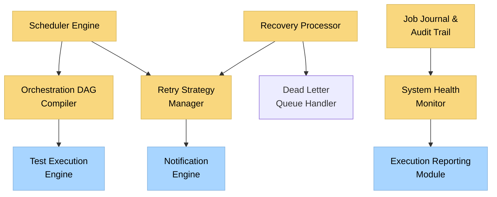
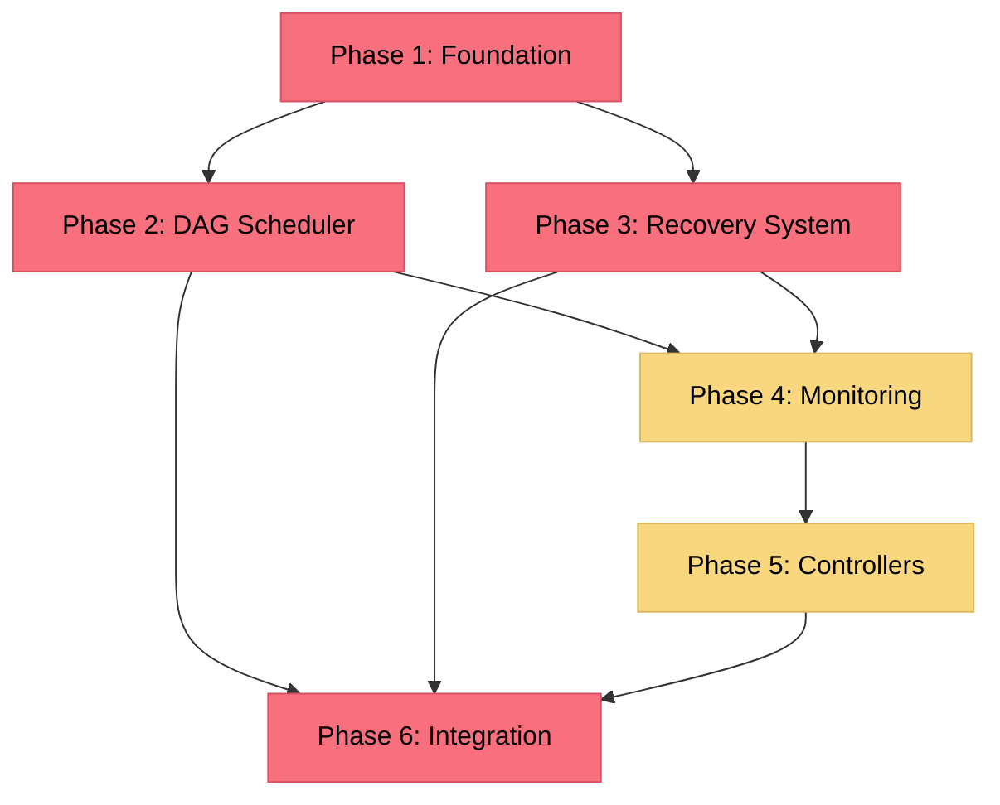
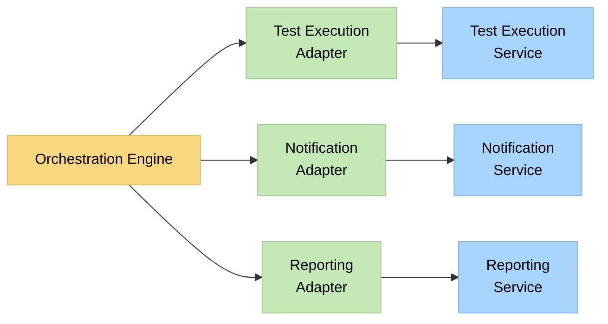
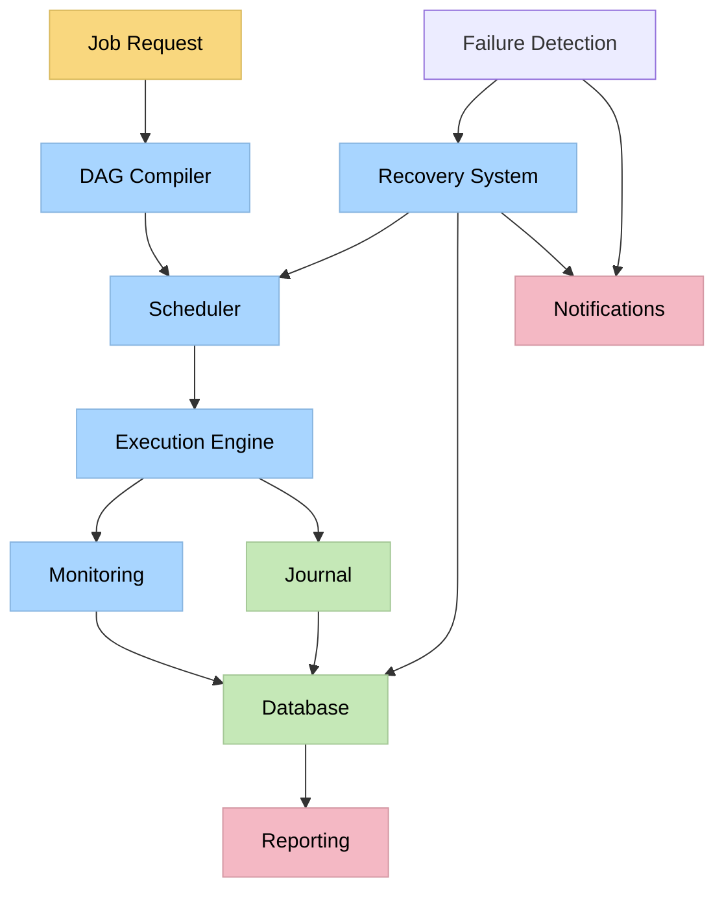
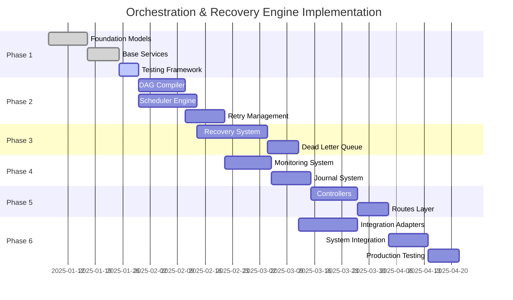

# PLAN: ORCHESTRATION & RECOVERY ENGINE

## Executive Summary
**Date**: 2025-01-06 22:20:00 UTC  
**Module**: Orchestration & Recovery Engine  
**Planning Phase**: PLAN Mode Implementation Strategy  
**Complexity Level**: Level 4 (Complex System) - Confirmed  
**Implementation Scope**: 6-phase distributed coordination system  
**Integration Dependencies**: Test Execution Engine, Notification Engine, Execution Reporting Module  

---

## 1. MILESTONE DEFINITION

### Primary Milestone: `orchestration-recovery-engine`
**Objective**: Implement a comprehensive distributed test execution coordination system with intelligent retry strategies, fault-tolerant recovery, and seamless integration with existing IntelliBrowse modules.

#### Core Subsystems Architecture


#### Subsystem Responsibilities

##### 1. Scheduler Engine (`scheduler/`)
**Purpose**: Core orchestration and job scheduling with priority management
**Key Components**:
- Job queue manager with priority-based scheduling
- Resource allocation optimizer across distributed nodes
- Execution graph processor for complex dependency management
- Load balancing coordinator for optimal resource utilization

##### 2. Recovery Processor (`recovery/`)
**Purpose**: Intelligent failure detection and automated recovery coordination
**Key Components**:
- Failure pattern analyzer with machine learning classification
- Recovery strategy executor with rollback capabilities
- State synchronization manager for distributed consistency
- Checkpoint manager for recovery point creation and restoration

##### 3. Orchestration DAG Compiler (`dag/`)
**Purpose**: Execution flow compilation and dependency resolution
**Key Components**:
- Graph compiler for test execution flow optimization
- Dependency resolver with circular dependency detection
- Conditional logic processor for dynamic flow adaptation
- Execution path optimizer for performance maximization

##### 4. Retry Strategy Manager (`retry/`)
**Purpose**: Context-aware retry logic with intelligent pattern recognition
**Key Components**:
- Strategy selector based on failure type and historical patterns
- Backoff algorithm engine (linear, exponential, fibonacci, custom)
- Circuit breaker manager for external dependency protection
- Retry effectiveness analyzer for strategy optimization

##### 5. Job Journal & Audit Trail (`journal/`)
**Purpose**: Comprehensive execution tracking and compliance audit trails
**Key Components**:
- Event sourcing system for complete execution history
- Audit trail generator with compliance-ready formatting
- Performance metrics collector for optimization insights
- Execution correlation tracker for cross-system analysis

##### 6. System Health Monitor (`health/`)
**Purpose**: Real-time system monitoring and predictive health analysis
**Key Components**:
- Node health tracker with availability monitoring
- Performance bottleneck detector with alerting
- Capacity planning analyzer with scaling recommendations
- Predictive failure detector with early warning systems

---

## 2. PHASE BREAKDOWN & IMPLEMENTATION STRATEGY

### Phase 1: Foundation Layer (Models, Schemas, Base Services)
**Duration**: 2-3 weeks  
**Complexity**: High  
**Priority**: Critical Path  

#### Deliverables
##### Models (`src/backend/orchestration/models/`)
- `execution_graph.py`: Execution flow graph data structures
- `job_definition.py`: Job specification and metadata models
- `retry_policy.py`: Retry strategy configuration models
- `recovery_state.py`: Recovery process state management
- `audit_event.py`: Event sourcing and audit trail models
- `health_metric.py`: System health and performance metrics

##### Schemas (`src/backend/orchestration/schemas/`)
- `orchestration_schemas.py`: Core orchestration request/response schemas
- `job_schemas.py`: Job submission and status schemas
- `retry_schemas.py`: Retry policy and execution schemas  
- `recovery_schemas.py`: Recovery procedure and state schemas
- `audit_schemas.py`: Audit event and reporting schemas
- `health_schemas.py`: Health monitoring and metrics schemas

##### Base Services (`src/backend/orchestration/services/`)
- `base_orchestration_service.py`: Core orchestration service interface
- `configuration_service.py`: Dynamic configuration management
- `validation_service.py`: Request validation and sanitization
- `logging_service.py`: Structured logging with correlation tracking

#### Implementation Approach
1. **Domain Model First**: Start with execution graph and job definition models
2. **Schema Validation**: Implement comprehensive Pydantic validation
3. **Service Foundation**: Create base service interfaces for dependency injection
4. **MongoDB Integration**: Design collections with optimization for graph queries
5. **Testing Framework**: Establish unit testing patterns for complex models

#### Integration Points
- **Database Layer**: MongoDB collections with graph-optimized indexing
- **Configuration System**: Environment-driven configuration management
- **Logging Framework**: Structured logging with correlation IDs
- **Validation Framework**: Pydantic schema validation throughout

#### Success Criteria
- [ ] All core data models implemented with comprehensive validation
- [ ] Database schema design optimized for graph queries and time-series data
- [ ] Base service interfaces established with dependency injection support
- [ ] Unit test coverage >90% for all foundation components
- [ ] Performance benchmarks established for model operations

### Phase 2: DAG Scheduler + Retry Queue Engine  
**Duration**: 3-4 weeks  
**Complexity**: Very High  
**Priority**: Critical Path  

#### Deliverables
##### DAG Compiler (`src/backend/orchestration/dag/`)
- `graph_compiler.py`: Execution graph compilation and optimization
- `dependency_resolver.py`: Dependency analysis and resolution
- `conditional_processor.py`: Dynamic conditional logic processing
- `path_optimizer.py`: Execution path optimization algorithms

##### Scheduler Engine (`src/backend/orchestration/scheduler/`)
- `job_scheduler.py`: Priority-based job scheduling engine
- `resource_allocator.py`: Dynamic resource allocation across nodes
- `queue_manager.py`: Multi-priority queue management
- `load_balancer.py`: Load balancing across execution nodes

##### Retry Management (`src/backend/orchestration/retry/`)
- `strategy_engine.py`: Retry strategy selection and execution
- `backoff_algorithms.py`: Configurable backoff algorithm implementations
- `circuit_breaker.py`: Circuit breaker pattern for external dependencies
- `effectiveness_analyzer.py`: Retry strategy performance analysis

#### Implementation Approach
1. **Graph Theory Foundation**: Implement DAG processing with cycle detection
2. **Scheduling Algorithms**: Priority-based scheduling with fairness guarantees
3. **Queue Architecture**: Multi-level priority queues with overflow handling
4. **Retry Intelligence**: Context-aware retry selection based on failure patterns
5. **Performance Optimization**: Async processing with connection pooling

#### Integration Points
- **Test Execution Engine**: Job submission and execution status monitoring
- **Database Layer**: Efficient graph storage and query optimization
- **Message Queue**: Redis/RabbitMQ for job queue management
- **Monitoring System**: Real-time performance metrics and alerting

#### Success Criteria
- [ ] Support for execution graphs with 1000+ nodes and complex dependencies
- [ ] Sub-100ms scheduling latency for job submission
- [ ] 99%+ successful dependency resolution for complex graphs
- [ ] Intelligent retry strategies with 95%+ failure resolution rate
- [ ] Load balancing achieving 90%+ resource utilization efficiency

### Phase 3: Failure Recovery + Dead Letter Queue
**Duration**: 3-4 weeks  
**Complexity**: Very High  
**Priority**: Critical Path  

#### Deliverables
##### Recovery Processor (`src/backend/orchestration/recovery/`)
- `failure_detector.py`: Real-time failure detection and classification
- `recovery_coordinator.py`: Automated recovery procedure execution
- `state_synchronizer.py`: Distributed state synchronization management
- `checkpoint_manager.py`: Recovery checkpoint creation and restoration
- `rollback_engine.py`: Partial execution rollback and cleanup

##### Dead Letter Queue (`src/backend/orchestration/dlq/`)
- `dlq_manager.py`: Dead letter queue management and processing
- `failure_analyzer.py`: Failed job analysis and pattern recognition
- `manual_intervention.py`: Manual review and intervention workflow
- `cleanup_processor.py`: Resource cleanup and deallocation

#### Implementation Approach
1. **Failure Detection**: Multi-layered failure detection with heartbeat monitoring
2. **Recovery Automation**: Intelligent recovery procedures with minimal manual intervention
3. **State Management**: Event sourcing for complete state reconstruction
4. **Rollback Capability**: Transactional rollback for partial execution failures
5. **Dead Letter Processing**: Systematic handling of irrecoverable failures

#### Integration Points
- **Notification Engine**: Real-time failure and recovery notifications
- **Execution Reporting**: Failure pattern analysis and trend reporting
- **Monitoring System**: Health checks and recovery procedure tracking
- **Alert Management**: Escalation procedures for manual intervention

#### Success Criteria
- [ ] Sub-60-second failure detection and recovery initiation
- [ ] 98%+ successful automated recovery from transient failures
- [ ] Zero data corruption during recovery procedures
- [ ] Complete audit trail for all failure and recovery events
- [ ] 95%+ successful rollback of partial executions

### Phase 4: Job Monitoring + Orchestration Journal
**Duration**: 2-3 weeks  
**Complexity**: High  
**Priority**: High  

#### Deliverables
##### Job Journal (`src/backend/orchestration/journal/`)
- `event_sourcing.py`: Event sourcing system for execution history
- `audit_trail.py`: Compliance-ready audit trail generation
- `correlation_tracker.py`: Cross-system execution correlation
- `metrics_collector.py`: Performance metrics collection and aggregation

##### Monitoring System (`src/backend/orchestration/monitoring/`)
- `execution_monitor.py`: Real-time execution progress monitoring
- `performance_tracker.py`: Performance metrics tracking and analysis
- `bottleneck_detector.py`: Performance bottleneck identification
- `capacity_planner.py`: Capacity planning and scaling recommendations

#### Implementation Approach
1. **Event Sourcing**: Complete execution history with event replay capability
2. **Audit Compliance**: Structured audit trails meeting compliance requirements
3. **Real-time Monitoring**: Live dashboards for execution progress tracking
4. **Performance Analytics**: Deep performance analysis with optimization recommendations
5. **Correlation Tracking**: Cross-system event correlation for troubleshooting

#### Integration Points
- **Execution Reporting Module**: Performance analytics and trend analysis
- **Database Layer**: Time-series data storage with efficient querying
- **Monitoring Dashboards**: Real-time visualization and alerting
- **Compliance Systems**: Audit trail export and integration

#### Success Criteria
- [ ] Complete execution history capture with sub-second granularity
- [ ] Real-time monitoring with <5-second update latency
- [ ] Compliance-ready audit trails with 100% data integrity
- [ ] Performance bottleneck detection with 90%+ accuracy
- [ ] Cross-system correlation tracking with complete trace coverage

### Phase 5: Controller + Routes Layer
**Duration**: 2-3 weeks  
**Complexity**: Medium-High  
**Priority**: High  

#### Deliverables
##### Controllers (`src/backend/orchestration/controllers/`)
- `orchestration_controller.py`: Main orchestration HTTP API controller
- `job_controller.py`: Job management and status API controller
- `retry_controller.py`: Retry policy and execution API controller
- `recovery_controller.py`: Recovery procedure and status API controller
- `health_controller.py`: System health and monitoring API controller

##### Routes (`src/backend/orchestration/routes/`)
- `orchestration_routes.py`: Core orchestration endpoint definitions
- `job_routes.py`: Job management endpoint definitions
- `admin_routes.py`: Administrative control endpoint definitions
- `monitoring_routes.py`: Monitoring and health check endpoints

#### Implementation Approach
1. **RESTful API Design**: Clean REST API with proper HTTP status codes
2. **Authentication Integration**: JWT-based authentication with role-based access
3. **Input Validation**: Comprehensive request validation and sanitization
4. **Error Handling**: Structured error responses with detailed messaging
5. **API Documentation**: Complete OpenAPI documentation with examples

#### Integration Points
- **Authentication System**: JWT validation and user context propagation
- **Service Layer**: Clean separation between HTTP layer and business logic
- **Validation Framework**: Request/response validation with Pydantic
- **API Gateway**: Integration with existing API gateway patterns

#### Success Criteria
- [ ] Complete REST API with 100% OpenAPI documentation coverage
- [ ] Sub-200ms response times for 95% of API operations
- [ ] Comprehensive input validation with security-focused sanitization
- [ ] Role-based access control with fine-grained permissions
- [ ] Structured error handling with actionable error messages

### Phase 6: Integration with TestExecution + Notification Engine
**Duration**: 3-4 weeks  
**Complexity**: Very High  
**Priority**: Critical Path  

#### Deliverables
##### Integration Layer (`src/backend/orchestration/integration/`)
- `test_execution_adapter.py`: Test Execution Engine integration adapter
- `notification_adapter.py`: Notification Engine integration adapter
- `reporting_adapter.py`: Execution Reporting Module integration adapter
- `event_coordinator.py`: Cross-system event coordination and messaging

##### System Integration (`src/backend/orchestration/system/`)
- `startup_coordinator.py`: System startup and initialization coordination
- `health_aggregator.py`: Cross-system health monitoring aggregation
- `configuration_manager.py`: Cross-system configuration management
- `migration_manager.py`: Database migration and versioning management

#### Implementation Approach
1. **Adapter Pattern**: Clean integration adapters for each external system
2. **Event-Driven Architecture**: Asynchronous event processing for real-time coordination
3. **Circuit Breaker Integration**: Resilient external system integration
4. **Configuration Management**: Centralized configuration with environment overrides
5. **Health Monitoring**: Comprehensive cross-system health monitoring

#### Integration Points
- **Test Execution Engine**: Job submission, status monitoring, result collection
- **Notification Engine**: Event-driven notifications for failures and recovery
- **Execution Reporting Module**: Performance metrics and analytics integration
- **Database Layer**: Cross-system data consistency and transaction management

#### Success Criteria
- [ ] Seamless integration with all target modules without breaking changes
- [ ] 99.9%+ system availability through resilient integration patterns
- [ ] Real-time event processing with <1-second latency
- [ ] Complete cross-system health monitoring and alerting
- [ ] Zero-downtime deployment and configuration updates

---

## 3. FILE & DIRECTORY STRUCTURE

```
src/backend/orchestration/
├── __init__.py
├── models/
│   ├── __init__.py
│   ├── execution_graph.py
│   ├── job_definition.py
│   ├── retry_policy.py
│   ├── recovery_state.py
│   ├── audit_event.py
│   └── health_metric.py
├── schemas/
│   ├── __init__.py
│   ├── orchestration_schemas.py
│   ├── job_schemas.py
│   ├── retry_schemas.py
│   ├── recovery_schemas.py
│   ├── audit_schemas.py
│   └── health_schemas.py
├── services/
│   ├── __init__.py
│   ├── base_orchestration_service.py
│   ├── configuration_service.py
│   ├── validation_service.py
│   └── logging_service.py
├── dag/
│   ├── __init__.py
│   ├── graph_compiler.py
│   ├── dependency_resolver.py
│   ├── conditional_processor.py
│   └── path_optimizer.py
├── scheduler/
│   ├── __init__.py
│   ├── job_scheduler.py
│   ├── resource_allocator.py
│   ├── queue_manager.py
│   └── load_balancer.py
├── retry/
│   ├── __init__.py
│   ├── strategy_engine.py
│   ├── backoff_algorithms.py
│   ├── circuit_breaker.py
│   └── effectiveness_analyzer.py
├── recovery/
│   ├── __init__.py
│   ├── failure_detector.py
│   ├── recovery_coordinator.py
│   ├── state_synchronizer.py
│   ├── checkpoint_manager.py
│   └── rollback_engine.py
├── dlq/
│   ├── __init__.py
│   ├── dlq_manager.py
│   ├── failure_analyzer.py
│   ├── manual_intervention.py
│   └── cleanup_processor.py
├── journal/
│   ├── __init__.py
│   ├── event_sourcing.py
│   ├── audit_trail.py
│   ├── correlation_tracker.py
│   └── metrics_collector.py
├── monitoring/
│   ├── __init__.py
│   ├── execution_monitor.py
│   ├── performance_tracker.py
│   ├── bottleneck_detector.py
│   └── capacity_planner.py
├── controllers/
│   ├── __init__.py
│   ├── orchestration_controller.py
│   ├── job_controller.py
│   ├── retry_controller.py
│   ├── recovery_controller.py
│   └── health_controller.py
├── routes/
│   ├── __init__.py
│   ├── orchestration_routes.py
│   ├── job_routes.py
│   ├── admin_routes.py
│   └── monitoring_routes.py
├── integration/
│   ├── __init__.py
│   ├── test_execution_adapter.py
│   ├── notification_adapter.py
│   ├── reporting_adapter.py
│   └── event_coordinator.py
├── system/
│   ├── __init__.py
│   ├── startup_coordinator.py
│   ├── health_aggregator.py
│   ├── configuration_manager.py
│   └── migration_manager.py
└── workers/
    ├── __init__.py
    ├── job_processor.py
    ├── recovery_worker.py
    ├── monitoring_worker.py
    └── cleanup_worker.py
```

### Shared Dependencies Structure
```
src/backend/core/
├── queues/
│   ├── __init__.py
│   ├── priority_queue.py
│   ├── distributed_queue.py
│   └── message_broker.py
├── schedulers/
│   ├── __init__.py
│   ├── base_scheduler.py
│   ├── cron_scheduler.py
│   └── event_scheduler.py
└── retry/
    ├── __init__.py
    ├── retry_patterns.py
    ├── backoff_strategies.py
    └── circuit_breakers.py
```

---

## 4. CROSS-SYSTEM DEPENDENCIES & INTEGRATION CONTRACTS

### Integration Contract: Test Execution Engine
**Service**: `testexecution.services.execution_trace_service`

#### Required Interface Methods
```python
# Orchestration → Test Execution
async def submit_job(execution_request: ExecutionRequest) -> JobSubmissionResult
async def get_execution_status(job_id: str) -> ExecutionStatus
async def cancel_execution(job_id: str) -> CancellationResult
async def get_execution_results(job_id: str) -> ExecutionResults

# Test Execution → Orchestration (Event Callbacks)
async def on_execution_started(job_id: str, context: ExecutionContext) -> None
async def on_execution_progress(job_id: str, progress: ProgressUpdate) -> None
async def on_execution_completed(job_id: str, results: ExecutionResults) -> None
async def on_execution_failed(job_id: str, failure: FailureDetails) -> None
```

#### Data Exchange Models
```python
@dataclass
class ExecutionRequest:
    job_id: str
    test_suite_id: str
    execution_graph: ExecutionGraph
    priority: JobPriority
    retry_policy: RetryPolicy
    timeout_config: TimeoutConfig

@dataclass  
class ExecutionStatus:
    job_id: str
    status: ExecutionState
    progress_percentage: float
    current_node: str
    estimated_completion: datetime
    resource_utilization: ResourceMetrics
```

### Integration Contract: Notification Engine
**Service**: `notification.services.notification_service`

#### Required Interface Methods
```python
# Orchestration → Notification
async def send_execution_notification(notification: ExecutionNotification) -> NotificationResult
async def send_failure_alert(alert: FailureAlert) -> NotificationResult
async def send_recovery_notification(recovery: RecoveryNotification) -> NotificationResult
async def send_health_alert(health: HealthAlert) -> NotificationResult
```

#### Event Types & Triggers
```python
class OrchestrationEvents:
    # Execution Events
    EXECUTION_STARTED = "orchestration.execution.started"
    EXECUTION_COMPLETED = "orchestration.execution.completed"
    EXECUTION_FAILED = "orchestration.execution.failed"
    
    # Recovery Events
    RECOVERY_INITIATED = "orchestration.recovery.initiated"
    RECOVERY_COMPLETED = "orchestration.recovery.completed"
    RECOVERY_FAILED = "orchestration.recovery.failed"
    
    # System Events
    SYSTEM_OVERLOAD = "orchestration.system.overload"
    NODE_FAILURE = "orchestration.node.failure"
    CAPACITY_WARNING = "orchestration.capacity.warning"
```

### Integration Contract: Execution Reporting Module
**Service**: `executionreporting.services.report_service`

#### Required Interface Methods
```python
# Orchestration → Reporting
async def submit_execution_metrics(metrics: ExecutionMetrics) -> None
async def submit_performance_data(performance: PerformanceData) -> None
async def submit_failure_analysis(analysis: FailureAnalysis) -> None
async def submit_capacity_metrics(capacity: CapacityMetrics) -> None

# Reporting → Orchestration (Analytics Feedback)
async def get_performance_insights(criteria: AnalyticsCriteria) -> PerformanceInsights
async def get_failure_patterns(criteria: FailureAnalyticsCriteria) -> FailurePatterns
async def get_capacity_trends(criteria: CapacityAnalyticsCriteria) -> CapacityTrends
```

---

## 5. SECURITY & VALIDATION FRAMEWORK

### JWT-Scoped Job Ownership
```python
class JobOwnershipValidator:
    """Ensures users can only access jobs they own or have permission for"""
    
    async def validate_job_access(self, user_context: UserContext, job_id: str) -> bool:
        job = await self.job_repository.get_job(job_id)
        return (
            job.owner_id == user_context.user_id or
            user_context.has_permission("orchestration.admin") or
            job.shared_with_users.contains(user_context.user_id)
        )
```

### Retry Escalation Control
```python
class RetryEscalationValidator:
    """Controls retry escalation based on job type and user permissions"""
    
    ESCALATION_PERMISSIONS = {
        JobType.CRITICAL: "orchestration.retry.critical",
        JobType.STANDARD: "orchestration.retry.standard", 
        JobType.LOW_PRIORITY: "orchestration.retry.basic"
    }
    
    async def can_escalate_retry(self, user_context: UserContext, job: Job, retry_level: int) -> bool:
        required_permission = self.ESCALATION_PERMISSIONS.get(job.job_type)
        return user_context.has_permission(required_permission) and retry_level <= job.max_retry_level
```

### Retry Strategy Validation  
```python
class RetryStrategyValidator:
    """Validates retry strategies are within allowed parameters per test suite"""
    
    async def validate_retry_strategy(self, test_suite_id: str, retry_policy: RetryPolicy) -> ValidationResult:
        suite_config = await self.suite_repository.get_retry_config(test_suite_id)
        
        validations = [
            self._validate_strategy_type(retry_policy.strategy, suite_config.allowed_strategies),
            self._validate_max_attempts(retry_policy.max_attempts, suite_config.max_attempts),
            self._validate_backoff_parameters(retry_policy.backoff_config, suite_config.backoff_limits),
            self._validate_timeout_limits(retry_policy.timeout_config, suite_config.timeout_limits)
        ]
        
        return ValidationResult.combine(validations)
```

### State Validation with Pydantic & Enum
```python
class ExecutionStateValidator(BaseModel):
    """Comprehensive state validation using Pydantic and strict enums"""
    
    job_id: str = Field(..., regex=r'^[a-zA-Z0-9\-_]+$')
    current_state: ExecutionState
    previous_state: Optional[ExecutionState]
    transition_timestamp: datetime
    transition_reason: str = Field(..., min_length=1, max_length=500)
    
    @validator('current_state')
    def validate_state_transition(cls, current_state, values):
        previous_state = values.get('previous_state')
        if previous_state and not StateTransition.is_valid(previous_state, current_state):
            raise ValueError(f"Invalid state transition: {previous_state} -> {current_state}")
        return current_state
    
    class Config:
        use_enum_values = True
        validate_assignment = True
        extra = "forbid"
```

---

## 6. LOGGING & OBSERVABILITY FRAMEWORK

### Structured Logging per Orchestration Cycle
```python
class OrchestrationLogger:
    """Structured logging with correlation tracking for orchestration operations"""
    
    def __init__(self, correlation_id: str):
        self.correlation_id = correlation_id
        self.logger = structlog.get_logger().bind(
            subsystem="orchestration",
            correlation_id=correlation_id,
            component="orchestration_engine"
        )
    
    async def log_execution_start(self, job: Job) -> None:
        await self.logger.info(
            "orchestration_execution_started",
            job_id=job.id,
            job_type=job.job_type.value,
            priority=job.priority.value,
            execution_graph_nodes=len(job.execution_graph.nodes),
            estimated_duration=job.estimated_duration,
            resource_requirements=job.resource_requirements.dict()
        )
    
    async def log_failure_detection(self, failure: FailureEvent) -> None:
        await self.logger.error(
            "orchestration_failure_detected",
            job_id=failure.job_id,
            failure_type=failure.failure_type.value,
            failure_node=failure.failed_node,
            failure_reason=failure.reason,
            impact_assessment=failure.impact_assessment.dict(),
            recovery_strategy=failure.recommended_recovery_strategy
        )
```

### Alert on Recovery Failure
```python
class RecoveryFailureAlerter:
    """Critical alerting for recovery procedure failures"""
    
    async def handle_recovery_failure(self, recovery_event: RecoveryFailureEvent) -> None:
        # Log critical failure
        await self.logger.critical(
            "orchestration_recovery_failed",
            job_id=recovery_event.job_id,
            recovery_attempt=recovery_event.attempt_number,
            failure_reason=recovery_event.failure_reason,
            attempted_strategies=recovery_event.attempted_strategies,
            system_impact=recovery_event.system_impact.dict()
        )
        
        # Send immediate alert
        alert = CriticalAlert(
            title="Orchestration Recovery Failure",
            severity=AlertSeverity.CRITICAL,
            job_id=recovery_event.job_id,
            description=f"Recovery failed after {recovery_event.attempt_number} attempts",
            required_action="Manual intervention required",
            escalation_path=self._get_escalation_path(recovery_event)
        )
        
        await self.notification_service.send_critical_alert(alert)
```

### Orchestration TraceId in All Logs
```python
class TraceIdMiddleware:
    """Ensures all orchestration operations include trace IDs for correlation"""
    
    async def __call__(self, request: Request, call_next):
        # Extract or generate trace ID
        trace_id = (
            request.headers.get("X-Trace-Id") or
            request.headers.get("X-Correlation-Id") or
            self._generate_trace_id()
        )
        
        # Set trace context for all downstream operations
        with structlog.contextvars.bound_context(
            trace_id=trace_id,
            request_id=str(uuid.uuid4()),
            user_id=getattr(request.state, 'user_id', None),
            operation_type="orchestration"
        ):
            response = await call_next(request)
            response.headers["X-Trace-Id"] = trace_id
            return response
```

---

## 7. IMPLEMENTATION DEPENDENCIES & INTEGRATION MAP

### Critical Path Dependencies


### External System Integration Points


### Data Flow Architecture


---

## 8. MILESTONE TRACKING & SUCCESS CRITERIA

### Phase Completion Criteria

#### Phase 1: Foundation Layer
- [ ] **Data Models**: All 6 core model classes implemented with validation
- [ ] **Database Schema**: Collections designed with graph-optimized indexing
- [ ] **Base Services**: Service interfaces with dependency injection
- [ ] **Unit Tests**: >90% test coverage for all foundation components
- [ ] **Performance**: Model operations <10ms for 95% of cases

#### Phase 2: DAG Scheduler + Retry Queue Engine
- [ ] **Graph Processing**: Support for 1000+ node execution graphs
- [ ] **Scheduling Performance**: <100ms job scheduling latency
- [ ] **Queue Management**: Multi-priority queues with overflow handling
- [ ] **Retry Intelligence**: 95%+ failure resolution through intelligent retry
- [ ] **Load Balancing**: 90%+ resource utilization efficiency

#### Phase 3: Failure Recovery + Dead Letter Queue
- [ ] **Failure Detection**: <60-second failure detection and response
- [ ] **Recovery Success**: 98%+ automated recovery from transient failures
- [ ] **Data Integrity**: Zero data corruption during recovery procedures
- [ ] **Audit Trail**: Complete audit trail for all failure/recovery events
- [ ] **Rollback Capability**: 95%+ successful partial execution rollback

#### Phase 4: Job Monitoring + Orchestration Journal
- [ ] **Event Sourcing**: Complete execution history with replay capability
- [ ] **Real-time Monitoring**: <5-second monitoring update latency
- [ ] **Audit Compliance**: 100% data integrity in audit trails
- [ ] **Performance Analysis**: 90%+ accuracy in bottleneck detection
- [ ] **Correlation Tracking**: Complete cross-system trace coverage

#### Phase 5: Controller + Routes Layer
- [ ] **API Completeness**: 100% OpenAPI documentation coverage
- [ ] **Performance**: <200ms response times for 95% of operations
- [ ] **Security**: Role-based access control with fine-grained permissions
- [ ] **Validation**: Comprehensive input validation and sanitization
- [ ] **Error Handling**: Structured error responses with actionable messages

#### Phase 6: Integration Layer
- [ ] **Integration Resilience**: 99.9%+ availability through circuit breakers
- [ ] **Event Processing**: <1-second real-time event processing latency
- [ ] **Health Monitoring**: Complete cross-system health monitoring
- [ ] **Zero-Downtime**: Deployment without service interruption
- [ ] **Backward Compatibility**: No breaking changes to existing systems

### Overall Success Metrics
- **System Availability**: 99.5% uptime with automated recovery
- **Processing Capacity**: 500+ concurrent job executions across 50+ nodes
- **Recovery Effectiveness**: 98% automated recovery success rate
- **Performance**: Sub-100ms latency for 95% of operations
- **Manual Intervention**: 90% reduction in manual intervention requirements

---

## 9. RISK ASSESSMENT & MITIGATION STRATEGIES

### High-Risk Areas

#### Risk 1: Distributed State Consistency
**Probability**: Medium | **Impact**: High
**Description**: Risk of state corruption during node failures or network partitions
**Mitigation Strategies**:
- Implement event sourcing with distributed checkpoints
- Use MongoDB transactions for critical state updates
- Implement consensus mechanisms for distributed decisions
- Create automated state validation and repair procedures

#### Risk 2: Performance Bottlenecks at Scale
**Probability**: Medium | **Impact**: High  
**Description**: System performance degradation under high concurrent load
**Mitigation Strategies**:
- Implement comprehensive performance testing during development
- Design horizontal scaling patterns from the start
- Use connection pooling and async patterns throughout
- Implement performance monitoring with automated alerting

#### Risk 3: Integration Complexity
**Probability**: High | **Impact**: Medium
**Description**: Complex integration requirements may break existing functionality
**Mitigation Strategies**:
- Design integration adapters with circuit breaker patterns
- Implement comprehensive integration testing
- Use feature flags for gradual rollout
- Maintain backward compatibility throughout development

### Medium-Risk Areas

#### Risk 4: Retry Strategy Effectiveness
**Probability**: Medium | **Impact**: Medium
**Description**: Retry strategies may be ineffective for certain failure types
**Mitigation Strategies**:
- Implement comprehensive failure pattern analysis
- Design adaptive retry strategies based on historical data
- Create strategy testing framework for validation
- Implement fallback procedures for retry failures

#### Risk 5: Recovery Procedure Reliability
**Probability**: Low | **Impact**: High
**Description**: Recovery procedures may fail in edge cases
**Mitigation Strategies**:
- Implement extensive failure scenario testing
- Design multiple recovery strategy options
- Create manual intervention procedures as fallback
- Implement recovery procedure validation and rollback

---

## 10. RESOURCE ALLOCATION & TIMELINE

### Development Team Structure
- **Architect/Tech Lead**: 1 person (full-time across all phases)
- **Backend Developers**: 2-3 people (distributed across phases)
- **Integration Specialist**: 1 person (focused on Phase 6)
- **QA Engineer**: 1 person (testing and validation across phases)

### Timeline Overview


### Resource Distribution
| Phase | Duration | Developer-Weeks | Primary Focus Areas |
|-------|----------|-----------------|-------------------|
| Phase 1 | 3 weeks | 6 dev-weeks | Foundation, models, schemas |
| Phase 2 | 4 weeks | 12 dev-weeks | DAG processing, scheduling |
| Phase 3 | 4 weeks | 12 dev-weeks | Recovery, failure handling |
| Phase 4 | 3 weeks | 8 dev-weeks | Monitoring, journaling |
| Phase 5 | 3 weeks | 6 dev-weeks | API layer, controllers |
| Phase 6 | 4 weeks | 10 dev-weeks | Integration, testing |
| **Total** | **21 weeks** | **54 dev-weeks** | **Complete system** |

---

**🎯 ORCHESTRATION ENGINE PLAN STATUS: COMPLETE ✅**  
**Planning Scope**: 6-phase implementation with distributed coordination complexity  
**Implementation Strategy**: Phased delivery with critical path optimization  
**Integration Strategy**: Adapter pattern with circuit breaker resilience  
**Risk Mitigation**: Comprehensive risk assessment with proactive mitigation strategies  
**Success Criteria**: Measurable goals with specific performance and reliability targets  

**Memory Bank Integration**: Plan document ready for task tracking and implementation phases  
**Next Action**: Ready for implementation Phase 1 - Foundation Layer development 