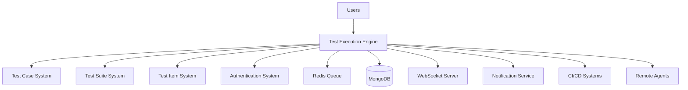
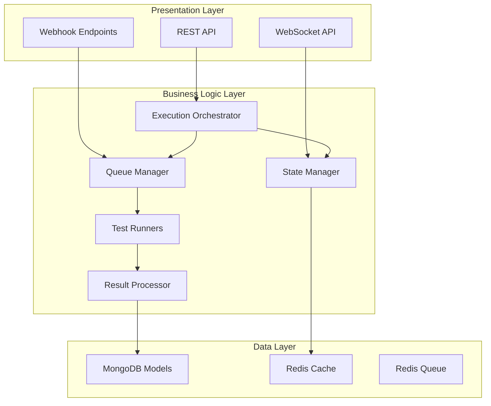

# Test Execution Engine - Comprehensive Plan
**Level 4 Complex System Implementation Plan**

## Executive Summary
**Module**: `src/backend/testexecution/`  
**Complexity Level**: Level 4 (Complex System)  
**Plan Creation Date**: 2025-01-05 21:45:00 UTC  
**Estimated Timeline**: 6-8 weeks  
**Team Size**: 2-3 developers  

## 📋 Requirements Analysis

### Core Requirements
- **Execution Orchestration**: Coordinate complete test execution lifecycle from queue to completion
- **Queue Management**: Async execution queue with priority handling and background processing
- **Real-Time Monitoring**: Live execution status tracking with WebSocket communication
- **State Management**: Comprehensive execution state tracking and synchronization
- **Result Processing**: Execution result handling, aggregation, and reporting
- **CI/CD Integration**: Extensible architecture for external system integration
- **Agent Support**: Distributed execution on remote agents (future enhancement)

### Non-Functional Requirements
- **Performance**: Support 100+ concurrent executions with <1s state update latency
- **Scalability**: Horizontal scaling support with stateless workers
- **Reliability**: 99.9% uptime with automatic recovery from failures
- **Security**: Role-based access control with execution isolation
- **Maintainability**: Clean architecture with comprehensive testing
- **Observability**: Full monitoring with metrics, logging, and alerting

## 🏗️ Architecture Overview

### System Context

### High-Level Architecture

## 🧩 Components Analysis

### Component 1: Execution Orchestration Layer
**Purpose**: Central coordination of test execution lifecycle
**Files**: 
- `orchestrator/execution_orchestrator.py`
- `orchestrator/execution_scheduler.py`
- `orchestrator/execution_monitor.py`

**Responsibilities**:
- Coordinate execution requests from API endpoints
- Schedule executions based on priority and resource availability
- Monitor execution progress and handle state transitions
- Coordinate result collection and notification dispatch

**Key Interfaces**:
- `async def execute_test_case(test_case_id: str, context: ExecutionContext) -> ExecutionResult`
- `async def execute_test_suite(test_suite_id: str, context: ExecutionContext) -> SuiteExecutionResult`
- `async def monitor_execution(execution_id: str) -> AsyncIterator[ExecutionUpdate]`

### Component 2: Queue Management System
**Purpose**: Async execution queue with priority handling
**Files**:
- `queue/execution_queue.py`
- `queue/queue_manager.py`
- `queue/job_processor.py`

**Responsibilities**:
- Manage execution queue with priority-based scheduling
- Process background jobs with retry logic
- Handle dead letter queue for failed executions
- Provide queue metrics and health monitoring

**Key Interfaces**:
- `async def enqueue_execution(execution_request: ExecutionRequest) -> str`
- `async def process_queue_batch(batch_size: int) -> List[ExecutionResult]`
- `async def get_queue_status() -> QueueStatus`

### Component 3: Execution State Management
**Purpose**: Real-time state tracking and recovery
**Files**:
- `state/execution_state_tracker.py`
- `state/state_notification_service.py`
- `state/execution_history.py`
- `state/state_recovery_service.py`

**Responsibilities**:
- Track real-time execution state with atomic updates
- Emit state change events for subscribers
- Maintain execution history and audit trail
- Provide crash recovery and state restoration

**Key Interfaces**:
- `async def update_execution_state(execution_id: str, new_state: ExecutionStatus) -> None`
- `async def subscribe_to_state_changes(execution_id: str) -> AsyncIterator[StateChange]`
- `async def recover_execution_state(execution_id: str) -> ExecutionState`

### Component 4: Test Runner Framework
**Purpose**: Extensible execution engine for multiple test types
**Files**:
- `runners/base_test_runner.py`
- `runners/generic_test_runner.py`
- `runners/bdd_test_runner.py`
- `runners/manual_test_runner.py`
- `runners/test_runner_factory.py`

**Responsibilities**:
- Execute test cases based on type (GENERIC, BDD, MANUAL)
- Provide step-by-step execution with progress tracking
- Handle execution errors and retries
- Generate detailed execution reports

**Key Interfaces**:
- `async def execute_test(test_case: TestCase, context: ExecutionContext) -> ExecutionResult`
- `async def execute_step(step: TestStep, context: StepContext) -> StepResult`
- `async def validate_execution_preconditions(test_case: TestCase) -> ValidationResult`

### Component 5: Result Processing System
**Purpose**: Execution result handling and reporting
**Files**:
- `results/result_processor.py`
- `results/result_aggregator.py`
- `results/report_generator.py`
- `results/result_notification_service.py`

**Responsibilities**:
- Process and validate execution results
- Aggregate multi-test and suite results
- Generate comprehensive execution reports
- Send result-based notifications

**Key Interfaces**:
- `async def process_execution_result(execution_id: str, result: RawExecutionResult) -> ProcessedResult`
- `async def aggregate_suite_results(suite_execution_id: str) -> SuiteResult`
- `async def generate_execution_report(execution_id: str, format: ReportFormat) -> Report`

### Component 6: Monitoring and Observability
**Purpose**: Production monitoring and debugging capabilities
**Files**:
- `monitoring/execution_metrics.py`
- `monitoring/execution_logger.py`
- `monitoring/health_checker.py`
- `monitoring/execution_analytics.py`

**Responsibilities**:
- Collect performance and usage metrics
- Provide structured logging for executions
- Monitor execution engine health
- Generate usage analytics and insights

**Key Interfaces**:
- `async def collect_execution_metrics(execution_id: str) -> MetricsSnapshot`
- `async def log_execution_event(event: ExecutionEvent) -> None`
- `async def check_system_health() -> HealthStatus`

### Component 7: Configuration Management
**Purpose**: Execution environment configuration
**Files**:
- `config/execution_config.py`
- `config/runner_config.py`
- `config/resource_config.py`
- `config/integration_config.py`

**Responsibilities**:
- Manage environment-specific execution settings
- Configure test runner parameters
- Set resource limits and allocation
- Configure external integrations

### Component 8: Security and Access Control
**Purpose**: Execution security and permissions
**Files**:
- `security/execution_authorizer.py`
- `security/resource_guard.py`
- `security/audit_logger.py`
- `security/execution_isolation.py`

**Responsibilities**:
- Validate execution permissions
- Protect resource access
- Maintain security audit trail
- Ensure execution environment isolation

## 📝 Implementation Strategy

### Phase 1: Foundation Layer (Weeks 1-2)
**Objective**: Establish core models and basic infrastructure

**Tasks**:
1. **Model Layer Implementation**
   - Create `ExecutionModel` with state management
   - Implement `ExecutionStepModel` for step tracking
   - Build `ExecutionResultModel` for result storage
   - Set up MongoDB indexes for performance

2. **Schema Layer Implementation**
   - Define request/response schemas for execution API
   - Create WebSocket message schemas
   - Implement validation schemas for execution requests

3. **Basic Service Layer**
   - Build `ExecutionService` with CRUD operations
   - Implement basic state management
   - Create execution authorization logic

**Deliverables**:
- Complete model layer with database integration
- API schemas with validation
- Basic service operations

**Quality Gates**:
- All models pass unit tests
- Database indexes optimize query performance
- Schema validation prevents invalid requests

### Phase 2: Core Execution Engine (Weeks 3-4)
**Objective**: Implement test runner framework and orchestration

**Tasks**:
1. **Test Runner Framework**
   - Implement `BaseTestRunner` abstract class
   - Build `GenericTestRunner` for standard tests
   - Create `BDDTestRunner` for BDD tests
   - Implement `ManualTestRunner` for manual tests

2. **Execution Orchestration**
   - Build `ExecutionOrchestrator` for lifecycle management
   - Implement step-by-step execution logic
   - Create error handling and retry mechanisms
   - Add execution timeout management

3. **Result Processing**
   - Implement `ResultProcessor` for result validation
   - Build result aggregation for suite executions
   - Create basic report generation

**Deliverables**:
- Complete test runner framework
- Execution orchestration system
- Result processing pipeline

**Quality Gates**:
- Test runners handle all test types correctly
- Orchestration manages execution lifecycle properly
- Results are processed and stored accurately

### Phase 3: Queue and State Management (Weeks 5-6)
**Objective**: Implement async queue processing and real-time state tracking

**Tasks**:
1. **Queue Management System**
   - Implement Redis-based execution queue
   - Build background job processing with Celery
   - Create priority-based queue scheduling
   - Add dead letter queue handling

2. **State Management**
   - Build real-time state tracking system
   - Implement WebSocket-based state notifications
   - Create state recovery mechanisms
   - Add execution history tracking

3. **Integration Testing**
   - Test queue processing with concurrent executions
   - Validate state synchronization accuracy
   - Test WebSocket communication reliability

**Deliverables**:
- Production-ready queue management
- Real-time state tracking system
- Reliable WebSocket communication

**Quality Gates**:
- Queue handles high-volume execution requests
- State updates are atomic and consistent
- WebSocket connections are stable and scalable

### Phase 4: API and Integration Layer (Weeks 7-8)
**Objective**: Complete API implementation and external integrations

**Tasks**:
1. **REST API Implementation**
   - Build execution CRUD endpoints
   - Implement bulk execution operations
   - Add execution filtering and search
   - Create execution report endpoints

2. **WebSocket API**
   - Implement real-time execution monitoring
   - Build execution progress streaming
   - Add execution event broadcasting

3. **External Integrations**
   - Build webhook endpoints for CI/CD
   - Implement basic agent communication
   - Add notification service integration

4. **Monitoring and Observability**
   - Implement metrics collection
   - Add structured logging
   - Build health check endpoints

**Deliverables**:
- Complete REST and WebSocket APIs
- External integration capabilities
- Production monitoring system

**Quality Gates**:
- API endpoints meet performance requirements
- WebSocket API supports required concurrent connections
- External integrations are secure and reliable

## 🔗 Dependencies and Integration Points

### Internal Dependencies
- **TestCase System**: Retrieve test case definitions and steps
- **TestSuite System**: Get suite composition and test case lists
- **TestItem System**: Access test item data and configuration
- **Authentication System**: Validate user permissions for executions

### External Dependencies
- **Redis**: Queue management and caching infrastructure
- **Celery**: Background job processing for async executions
- **WebSocket Library**: Real-time communication with frontend
- **Monitoring Tools**: Metrics collection and alerting

### Integration Challenges
1. **State Synchronization**: Ensure atomic updates across distributed components
2. **Queue Reliability**: Handle Redis failures and queue persistence
3. **WebSocket Scaling**: Manage WebSocket connections at scale
4. **Error Propagation**: Properly propagate errors through async processing

## ⚠️ Challenges and Mitigations

### Challenge 1: Concurrent Execution Management
**Description**: Managing multiple concurrent test executions without resource conflicts
**Risk Level**: High
**Mitigation Strategy**:
- Implement resource pooling and allocation
- Use distributed locking for critical resources
- Add queue-based load balancing
- Monitor resource usage and implement throttling

### Challenge 2: State Consistency
**Description**: Maintaining consistent execution state across async operations
**Risk Level**: High
**Mitigation Strategy**:
- Use database transactions for state updates
- Implement optimistic concurrency control
- Add state validation and reconciliation
- Use event sourcing for audit trail

### Challenge 3: Queue Reliability
**Description**: Ensuring execution queue reliability under high load
**Risk Level**: Medium
**Mitigation Strategy**:
- Implement queue persistence and backup
- Add dead letter queue handling
- Use queue monitoring and alerting
- Implement graceful degradation

### Challenge 4: WebSocket Connection Management
**Description**: Managing WebSocket connections at scale
**Risk Level**: Medium
**Mitigation Strategy**:
- Implement connection pooling and cleanup
- Add heartbeat and reconnection logic
- Use load balancing for WebSocket servers
- Monitor connection metrics

### Challenge 5: Integration Complexity
**Description**: Complex integration with multiple existing systems
**Risk Level**: Medium
**Mitigation Strategy**:
- Use dependency injection for loose coupling
- Implement comprehensive integration tests
- Add circuit breaker patterns for external calls
- Create fallback mechanisms for integration failures

## 🎨 Creative Phase Components

### Creative Component 1: Execution State Machine Design
**Requirement**: Design optimal state machine for execution lifecycle
**Complexity**: High - Multiple states with complex transitions
**Questions to Explore**:
- What are the optimal state transitions for different execution scenarios?
- How should error states be handled and recovered?
- What intermediate states are needed for user experience?

### Creative Component 2: Queue Priority Algorithm
**Requirement**: Design intelligent queue priority calculation
**Complexity**: Medium - Multiple factors influence priority
**Questions to Explore**:
- How should execution priority be calculated dynamically?
- What factors should influence queue position (user priority, test type, etc.)?
- How should starvation prevention be implemented?

### Creative Component 3: Real-Time Communication Architecture
**Requirement**: Design scalable real-time communication system
**Complexity**: High - WebSocket scaling and connection management
**Questions to Explore**:
- What is the optimal WebSocket architecture for scalability?
- How should execution progress be streamed efficiently?
- What backup communication methods should be available?

### Creative Component 4: Agent Communication Protocol
**Requirement**: Design protocol for remote agent communication
**Complexity**: High - Distributed system communication
**Questions to Explore**:
- What communication protocol is best for agent coordination?
- How should agent discovery and capability reporting work?
- What security model is needed for agent communication?

## ✅ Quality Metrics and Verification

### Performance Metrics
- **Execution Throughput**: >100 concurrent executions
- **Queue Processing Latency**: <5 seconds
- **State Update Latency**: <1 second
- **API Response Time**: <500ms
- **WebSocket Message Latency**: <100ms

### Reliability Metrics
- **System Uptime**: >99.9%
- **Execution Success Rate**: >95%
- **Queue Processing Success Rate**: >99%
- **State Consistency**: 100%
- **Recovery Time**: <30 seconds

### Quality Gates
1. **Unit Test Coverage**: >90%
2. **Integration Test Coverage**: >80%
3. **Performance Test Results**: Meet all benchmarks
4. **Security Scan**: No high-risk vulnerabilities
5. **Code Review**: All components peer reviewed

## 📊 Progress Tracking

### Milestones
- **Milestone 1**: Foundation Layer Complete (Week 2)
- **Milestone 2**: Core Engine Complete (Week 4)
- **Milestone 3**: Queue & State Management Complete (Week 6)
- **Milestone 4**: API & Integration Complete (Week 8)

### Success Criteria
- All execution types (GENERIC, BDD, MANUAL) supported
- Real-time execution monitoring functional
- Queue processing handles high-volume requests
- WebSocket communication stable and scalable
- External integration endpoints operational
- Performance metrics meet requirements

## 🔄 Next Steps

1. **Immediate Action**: Begin Phase 1 implementation with model layer
2. **Resource Allocation**: Assign 2-3 developers to different components
3. **Environment Setup**: Configure Redis and Celery infrastructure
4. **Testing Strategy**: Set up comprehensive testing environment
5. **Monitoring Setup**: Implement metrics collection and alerting

**Next Mode Recommendation**: CREATIVE MODE for state machine design and queue priority algorithm 