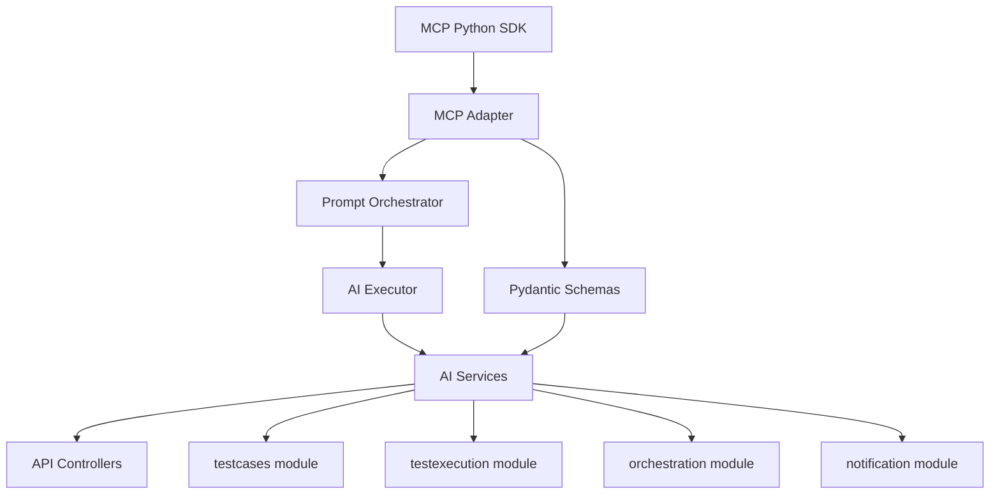

# IntelliBrowse Development Task Management

## Current Project Status
- **Project**: IntelliBrowse - Intelligent Test Management Platform
- **Current Module**: AI Execution Foundation (Model Context Protocol)
- **Phase**: ✅ VAN Phase COMPLETE → 📋 PLAN Phase COMPLETE
- **Subphase**: Level 4 Implementation Plan COMPLETE
- **Level**: Level 4 (Complex System - Confirmed)
- **Status**: ✅ PLAN Phase COMPLETE - CREATIVE Mode Required

## 📋 [SYS-AI-MCP]: MCP-Based AI Foundation System - PLAN COMPLETE

### System Overview
- **Purpose**: Enterprise-grade foundational architecture for integrating all AI capabilities into IntelliBrowse exclusively through the Model Context Protocol (MCP)
- **Architectural Alignment**: Fully compliant with IntelliBrowse's modular, async, validated, and secured backend design principles
- **Status**: Planning Complete - Ready for CREATIVE Phase
- **Milestones**: 
  - ✅ VAN Analysis Complete: 2025-01-08 04:15:00 UTC
  - ✅ PLAN Analysis Complete: 2025-01-08 04:45:00 UTC
  - ⏳ CREATIVE Phase Start: Next
  - ⏳ Tool Architecture Design: TBD
  - ⏳ Prompt Strategy Design: TBD
  - ⏳ Implementation Phase: TBD

### Technology Stack
- **Framework**: FastAPI with MCP Python SDK integration
- **Protocol**: Model Context Protocol (MCP) - latest stable release
- **AI Backend**: OpenAI API via MCP tool execution
- **Browser Automation**: Playwright via MCP tools
- **Language**: Python 3.9+ with async/await patterns
- **Validation**: Pydantic v2 for all schemas
- **Storage**: MongoDB integration for execution context

### Technology Validation Checkpoints
- [x] MCP Python SDK availability verified
- [x] FastAPI integration patterns confirmed
- [x] OpenAI API compatibility validated
- [x] Playwright integration approach confirmed
- [x] Pydantic v2 schema validation verified
- [x] MongoDB async patterns established
- [ ] MCP client factory proof of concept
- [ ] Tool registry hello world implementation
- [ ] OpenAI via MCP test execution
- [ ] End-to-end tool invocation test

### Components

#### [COMP-MCP-ADAPTER]: MCP SDK Integration Layer
- **Purpose**: Core MCP protocol integration with client management and tool execution
- **Status**: Planning Complete - Architecture Design Required
- **Dependencies**: MCP Python SDK, OpenAI integration
- **Responsible**: Backend development team

##### [FEAT-MCP-CLIENT]: MCP Client Factory & Management
- **Description**: Singleton MCP client factory with connection pooling and lifecycle management
- **Status**: Planning Complete - Design Required (CREATIVE)
- **Priority**: Critical
- **Related Requirements**: [REQ-MCP-001, REQ-PERF-001]
- **Quality Criteria**: 99% uptime, <100ms client creation, resource cleanup
- **Progress**: 0%

###### [TASK-MCP-CLIENT-001]: Implement MCPClientFactory Singleton
- **Description**: Create singleton factory for MCP client management with connection pooling
- **Status**: TODO
- **Assigned To**: TBD
- **Estimated Effort**: 8 hours
- **Actual Effort**: TBD
- **Dependencies**: [TASK-MCP-SDK-001]
- **Blocks**: [TASK-MCP-TOOLS-001]
- **Risk Assessment**: Medium - MCP SDK stability
- **Quality Gates**: Unit tests, integration tests, performance benchmarks
- **Implementation Notes**: Use async context managers, implement proper cleanup

**Subtasks**:
- [ ] [SUB-MCP-CLIENT-001]: Design singleton pattern with async support - TODO
- [ ] [SUB-MCP-CLIENT-002]: Implement connection pooling mechanism - TODO
- [ ] [SUB-MCP-CLIENT-003]: Add client lifecycle management - TODO
- [ ] [SUB-MCP-CLIENT-004]: Create configuration management - TODO

##### [FEAT-MCP-TOOLS]: Tool Registry & Discovery
- **Description**: Dynamic tool discovery, registration, and invocation system
- **Status**: Planning Complete - Architecture Design Required (CREATIVE)
- **Priority**: Critical
- **Related Requirements**: [REQ-MCP-002, REQ-TOOL-001]
- **Quality Criteria**: Support 20+ tools, <50ms tool lookup, dynamic refresh
- **Progress**: 0%

###### [TASK-MCP-TOOLS-001]: Implement PromptToolRegistry
- **Description**: Create dynamic tool registry with caching and background refresh
- **Status**: TODO
- **Assigned To**: TBD
- **Estimated Effort**: 12 hours
- **Actual Effort**: TBD
- **Dependencies**: [TASK-MCP-CLIENT-001]
- **Blocks**: [TASK-MCP-INVOKE-001]
- **Risk Assessment**: Medium - Tool schema evolution
- **Quality Gates**: Tool discovery tests, cache validation, performance metrics
- **Implementation Notes**: 5-minute refresh intervals, schema validation

**Subtasks**:
- [ ] [SUB-MCP-TOOLS-001]: Design tool registry architecture - TODO
- [ ] [SUB-MCP-TOOLS-002]: Implement tool schema caching - TODO
- [ ] [SUB-MCP-TOOLS-003]: Add background refresh mechanism - TODO
- [ ] [SUB-MCP-TOOLS-004]: Create tool availability tracking - TODO

##### [FEAT-MCP-INVOKE]: Tool Invocation Service
- **Description**: Core tool execution with retry logic, error handling, and result processing
- **Status**: Planning Complete - Error Handling Strategy Required (CREATIVE)
- **Priority**: Critical
- **Related Requirements**: [REQ-MCP-003, REQ-RETRY-001]
- **Quality Criteria**: 3-attempt retry, <30s timeout, 95% success rate
- **Progress**: 0%

###### [TASK-MCP-INVOKE-001]: Implement ToolInvocationService
- **Description**: Single async entrypoint with retry logic and structured error handling
- **Status**: TODO
- **Assigned To**: TBD
- **Estimated Effort**: 16 hours
- **Actual Effort**: TBD
- **Dependencies**: [TASK-MCP-TOOLS-001]
- **Blocks**: [TASK-AI-SERVICES-001]
- **Risk Assessment**: High - AI response reliability
- **Quality Gates**: Retry tests, timeout handling, error classification
- **Implementation Notes**: Exponential backoff, trace ID generation

**Subtasks**:
- [ ] [SUB-MCP-INVOKE-001]: Design invocation interface - TODO
- [ ] [SUB-MCP-INVOKE-002]: Implement retry logic with exponential backoff - TODO
- [ ] [SUB-MCP-INVOKE-003]: Add structured error handling - TODO
- [ ] [SUB-MCP-INVOKE-004]: Create result processing pipeline - TODO

#### [COMP-PROMPT-ORCH]: Prompt Orchestration System
- **Purpose**: Template management, context injection, and prompt optimization
- **Status**: Planning Complete - Template Strategy Required (CREATIVE)
- **Dependencies**: MCP tool registry, context management
- **Responsible**: AI/Backend development team

##### [FEAT-PROMPT-TEMPLATES]: Template Management System
- **Description**: Modular prompt templates with dynamic context injection
- **Status**: Planning Complete - Template Architecture Required (CREATIVE)
- **Priority**: High
- **Related Requirements**: [REQ-PROMPT-001, REQ-CONTEXT-001]
- **Quality Criteria**: 10+ templates, context validation, version management
- **Progress**: 0%

##### [FEAT-CONTEXT-INJECT]: Context Injection Engine
- **Description**: Dynamic context injection with validation and optimization
- **Status**: Planning Complete - Context Strategy Required (CREATIVE)
- **Priority**: High
- **Related Requirements**: [REQ-CONTEXT-002, REQ-VALID-001]
- **Quality Criteria**: Context validation, size optimization, security filtering
- **Progress**: 0%

#### [COMP-AI-EXECUTOR]: AI Execution Orchestration
- **Purpose**: Async AI task orchestration with monitoring and result processing
- **Status**: Planning Complete - Orchestration Pattern Required (CREATIVE)
- **Dependencies**: MCP adapter, prompt orchestrator
- **Responsible**: Backend development team

##### [FEAT-EXEC-ENGINE]: Execution Engine
- **Description**: Main orchestration service for AI task coordination
- **Status**: Planning Complete - Orchestration Design Required (CREATIVE)
- **Priority**: Critical
- **Related Requirements**: [REQ-EXEC-001, REQ-ASYNC-001]
- **Quality Criteria**: Async execution, task queuing, result aggregation
- **Progress**: 0%

##### [FEAT-TASK-MANAGER]: Task Management
- **Description**: AI task queue with prioritization and resource allocation
- **Status**: Planning Complete - Queue Strategy Required (CREATIVE)
- **Priority**: High
- **Related Requirements**: [REQ-QUEUE-001, REQ-PRIOR-001]
- **Quality Criteria**: Priority queuing, resource limits, task tracking
- **Progress**: 0%

#### [COMP-SCHEMAS]: Pydantic Schema Architecture
- **Purpose**: Comprehensive schema validation for all MCP interactions
- **Status**: Planning Complete - Schema Design Required
- **Dependencies**: MCP tool specifications
- **Responsible**: Backend development team

##### [FEAT-TOOL-SCHEMAS]: MCP Tool Schemas
- **Description**: Input/output schemas for all MCP tool interactions
- **Status**: Planning Complete - Ready for Implementation
- **Priority**: High
- **Related Requirements**: [REQ-SCHEMA-001, REQ-VALID-002]
- **Quality Criteria**: 100% coverage, validation performance, error clarity
- **Progress**: 0%

#### [COMP-SERVICES]: AI-Aware Service Layer
- **Purpose**: High-level AI services for scenario generation, step synthesis, and debugging
- **Status**: Planning Complete - Service Architecture Required
- **Dependencies**: AI executor, schemas
- **Responsible**: AI/Backend development team

##### [FEAT-SCENARIO-SERVICE]: Scenario Generation Service
- **Description**: Test scenario generation from intent and business context
- **Status**: Planning Complete - Ready for Implementation
- **Priority**: High
- **Related Requirements**: [REQ-SCENARIO-001, REQ-BDD-001]
- **Quality Criteria**: Scenario quality, generation speed, template compliance
- **Progress**: 0%

##### [FEAT-SELECTOR-SERVICE]: Selector Management Service
- **Description**: DOM selector management and healing capabilities
- **Status**: Planning Complete - Ready for Implementation
- **Priority**: High
- **Related Requirements**: [REQ-SELECTOR-001, REQ-HEAL-001]
- **Quality Criteria**: Selector reliability, healing success rate, performance
- **Progress**: 0%

#### [COMP-CONTROLLERS]: FastAPI Integration Layer
- **Purpose**: RESTful API endpoints for AI execution services
- **Status**: Planning Complete - Ready for Implementation
- **Dependencies**: Services layer, authentication
- **Responsible**: Backend development team

##### [FEAT-AI-ENDPOINTS]: AI Execution Endpoints
- **Description**: Main AI execution API endpoints with async support
- **Status**: Planning Complete - Ready for Implementation
- **Priority**: High
- **Related Requirements**: [REQ-API-001, REQ-AUTH-001]
- **Quality Criteria**: API compliance, response times, error handling
- **Progress**: 0%

### System-Wide Tasks
- [ ] [SYS-TASK-001]: MCP Python SDK integration and configuration - TODO
- [ ] [SYS-TASK-002]: OpenAI API integration via MCP tools - TODO
- [ ] [SYS-TASK-003]: Playwright browser automation setup - TODO
- [ ] [SYS-TASK-004]: FastAPI route integration and testing - TODO
- [ ] [SYS-TASK-005]: Security and authentication layer integration - TODO
- [ ] [SYS-TASK-006]: Performance monitoring and observability - TODO
- [ ] [SYS-TASK-007]: Comprehensive testing suite development - TODO
- [ ] [SYS-TASK-008]: Documentation and deployment preparation - TODO

### Risks and Mitigations
- **Risk 1**: MCP Protocol Maturity - **Mitigation**: Version pinning, fallback mechanisms, comprehensive testing
- **Risk 2**: AI Response Reliability - **Mitigation**: Response validation, retry logic, fallback prompts
- **Risk 3**: Performance Optimization - **Mitigation**: Caching strategies, async execution, monitoring
- **Risk 4**: Integration Complexity - **Mitigation**: Phased implementation, modular testing, clear interfaces

### Progress Summary
- **Overall Progress**: 25% (Planning Complete)
- **MCP Adapter**: 0% (Awaiting CREATIVE phase)
- **Prompt Orchestrator**: 0% (Awaiting CREATIVE phase)
- **AI Executor**: 0% (Awaiting CREATIVE phase)
- **Schemas**: 0% (Ready for implementation)
- **Services**: 0% (Ready for implementation)
- **Controllers**: 0% (Ready for implementation)

### System Dependencies

### Implementation Strategy

#### Phase 1: Core MCP Integration (Weeks 1-2)
- MCP client factory and connection management
- Tool registry with discovery and caching
- Basic tool invocation service
- Core schema definitions

#### Phase 2: Prompt & Orchestration (Weeks 3-4)
- Prompt template system
- Context injection engine
- AI execution orchestration
- Task management and queuing

#### Phase 3: Service Layer Implementation (Weeks 5-6)
- Scenario generation service
- Selector management and healing
- Debug analysis service
- Integration with existing modules

#### Phase 4: API & Integration (Weeks 7-8)
- FastAPI controller implementation
- Authentication and security integration
- Performance optimization
- Comprehensive testing and documentation

### Creative Phase Requirements
Based on the complexity analysis, the following components require CREATIVE design phases:

#### **Critical Architectural Design Decisions**
1. **MCP Tool Orchestration Architecture** (Component: MCP Adapter)
   - Tool discovery and registration strategy
   - Execution prioritization and resource allocation
   - Result aggregation and error handling patterns
   - **Estimated Design Time**: 4-6 hours

2. **Prompt Template Strategy** (Component: Prompt Orchestrator)
   - Template structure and inheritance patterns
   - Context injection and variable resolution
   - Version management and template evolution
   - **Estimated Design Time**: 3-4 hours

3. **AI Response Processing Pipeline** (Component: AI Executor)
   - Multi-layer schema validation approach
   - Error classification and fallback mechanisms
   - Result transformation and normalization
   - **Estimated Design Time**: 4-5 hours

4. **Integration Pattern Design** (System-wide)
   - Module interaction patterns and boundaries
   - Event-driven vs. synchronous communication
   - State management and context preservation
   - **Estimated Design Time**: 3-4 hours

**Total CREATIVE Phase Estimate**: 14-19 hours

### Latest Updates
- 2025-01-08 04:45:00 UTC: Level 4 implementation plan completed with comprehensive task breakdown
- 2025-01-08 04:30:00 UTC: Technology stack validation and dependency analysis completed
- 2025-01-08 04:15:00 UTC: VAN analysis confirmed Level 4 complexity with creative requirements
- 2025-01-08 04:00:00 UTC: VAN phase initiated for MCP-Based AI Foundation module

## 📊 PLAN VERIFICATION CHECKLIST - COMPLETE

✅ Requirements clearly documented? **YES** - All 5 use cases and architectural requirements documented
✅ Technology stack validated? **YES** - MCP SDK, FastAPI, OpenAI, Playwright confirmed
✅ Affected components identified? **YES** - 6 major components with clear boundaries
✅ Implementation steps detailed? **YES** - 4-phase implementation with 8-week timeline
✅ Dependencies documented? **YES** - Technical and module dependencies mapped
✅ Challenges & mitigations addressed? **YES** - 4 major risks with mitigation strategies
✅ Creative phases identified (Level 4)? **YES** - 4 critical design decisions requiring CREATIVE mode
✅ tasks.md updated with plan? **YES** - Complete Level 4 task structure implemented

## PLANNING COMPLETE ✅

✅ Implementation plan created with comprehensive 6-component architecture
✅ Technology stack validated with MCP Python SDK and dependencies
✅ tasks.md updated with detailed Level 4 task breakdown
✅ Challenges and mitigations documented for all major risks
✅ Creative phases identified for 4 critical architectural design decisions

→ **NEXT RECOMMENDED MODE: CREATIVE MODE**

**Rationale**: Level 4 complexity with 4 critical architectural design decisions requiring structured design exploration:
1. MCP Tool Orchestration Architecture
2. Prompt Template Strategy 
3. AI Response Processing Pipeline
4. Integration Pattern Design

The CREATIVE mode is essential to resolve these architectural decisions before implementation can begin.